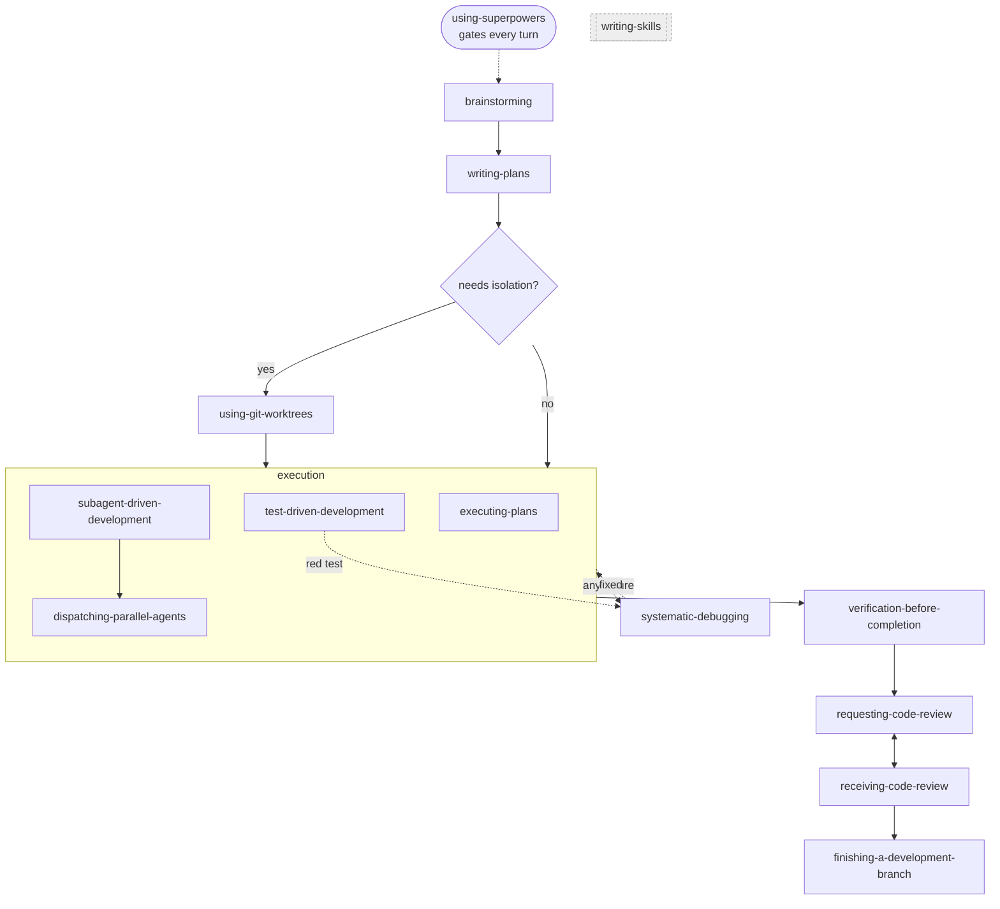

# Core Skills

The **14 core obra superpowers skills** that live in `v1/` — the supercharged-in-place
versions of `obra/superpowers` 5.1.0. This doc is the *map of the core*: what each one
is, what role it plays, and **how they relate to each other**.

> **Scope.** "Core" = the 14 v1 skills only. Supporting skills (v2), experiments (v3),
> Karpathy/Cherny tools (v4), the Forge import (v5), and the `frontend/` domain folder
> are *not* core — see `MANIFEST.md` for the full 166-skill catalog. The research-grounded
> mechanics of chaining (patterns, handoff contracts, the machine-readable graph options)
> live in `CHAINING-OPTIONS.md`; this doc references that wiring rather than re-deriving it.

---

## The 14 core skills — by role

The core isn't a flat list; each skill fires at a different point in a development cycle.
Grouped by *when it fires*:

| Role | Skill | Fires when |
|---|---|---|
| **Entry / router** | `using-superpowers` | Start of **every** turn — establishes how to find and invoke skills before any response |
| **Design** | `brainstorming` | Before any creative work — explores intent, requirements, design before implementation |
| **Plan** | `writing-plans` | You have a spec/requirements for a multi-step task, before touching code |
| **Isolate** | `using-git-worktrees` | Feature work needs isolation from the current workspace, before execution |
| **Execute (solo)** | `executing-plans` | A written plan is executed in a separate session with review checkpoints |
| **Execute (fan-out)** | `subagent-driven-development` | A plan with independent tasks is executed in the current session via subagents |
| **Execute (primitive)** | `dispatching-parallel-agents` | 2+ independent tasks with no shared state or sequential dependency |
| **Execute (discipline)** | `test-driven-development` | Implementing any feature or bugfix — before writing implementation code |
| **Repair (interrupt)** | `systematic-debugging` | Any bug, test failure, or unexpected behavior — before proposing a fix |
| **Verify (gate)** | `verification-before-completion` | About to claim work is complete/fixed/passing — evidence before assertions |
| **Review (request)** | `requesting-code-review` | Completing tasks or major features, before merging |
| **Review (receive)** | `receiving-code-review` | Receiving review feedback — rigor and verification, not performative agreement |
| **Finish** | `finishing-a-development-branch` | Implementation done and tests pass — decide merge / PR / cleanup |
| **Meta (reflexive)** | `writing-skills` | Creating, editing, or verifying skills themselves — including the skills in this repo |

---

## How they relate — the canonical chain

The core skills compose into one **feature-build spine** with three **always-on
behaviors** that interrupt or gate the spine rather than sitting in sequence.

### The spine (prompt chaining)
`brainstorming` → `writing-plans` → *(optional)* `using-git-worktrees` → **execution** →
`verification-before-completion` → `requesting-code-review` ⇄ `receiving-code-review` →
`finishing-a-development-branch`. Each step's output is the next step's input — a plan is
the input to execution, verified work is the input to review, reviewed work is the input
to finishing.

### Execution is a choice, not one path (routing + orchestrator-workers)
At the execute step you pick **one**:
- `executing-plans` — drive a plan solo in a fresh session with review checkpoints.
- `subagent-driven-development` — dispatch independent tasks to subagents in this session;
  it uses `dispatching-parallel-agents` as its fan-out primitive.

`test-driven-development` is **not** an alternative — it wraps whichever execution path you
chose (tests before code, every feature and bugfix).

### Three always-on behaviors (they fire on a condition, not a position)
- **`using-superpowers`** — the router at the top of every turn; gates entry to all 13 others.
- **`systematic-debugging`** — interrupts execution or a red TDD test on *any* failure, then
  returns control once the cause is found and fixed.
- **`verification-before-completion`** — the gate before any "done" claim; nothing reaches
  `finishing-a-development-branch` without passing it (the evaluator step of the chain).

### Reflexive
`writing-skills` stands apart from the build cycle — it's how the core skills (and every
skill in this repo) are authored, edited, and verified. It governs the others rather than
running in line with them.

---

## Relationship map — who hands to whom

| From | To | Relation | What crosses the seam |
|---|---|---|---|
| `using-superpowers` | *(all)* | routes | which skill(s) apply this turn |
| `brainstorming` | `writing-plans` | chains-to | agreed intent + design constraints |
| `writing-plans` | `using-git-worktrees` / execution | chains-to | the written, multi-step plan |
| `using-git-worktrees` | execution | precedes | an isolated workspace |
| `subagent-driven-development` | `dispatching-parallel-agents` | uses | independent task batches to fan out |
| execution | `test-driven-development` | wraps | red→green→refactor on each unit |
| execution / `test-driven-development` | `systematic-debugging` | interrupts | the failure to root-cause |
| execution | `verification-before-completion` | gates | claimed result + commands to prove it |
| `verification-before-completion` | `requesting-code-review` | chains-to | verified, evidence-backed work |
| `requesting-code-review` | `receiving-code-review` | loops with | review findings, then verified responses |
| `receiving-code-review` | `finishing-a-development-branch` | chains-to | reviewed work, ready to integrate |
| `writing-skills` | *(all)* | authors | the skill definitions themselves |

---

## How we build off this

The core 14 are the **baseline everything else measures against**. Every other tier
takes the core as given and extends it in *one* direction — none of them re-implement a
core skill, they wrap it, support it, or reach past it.

| Tier | How it builds off the core | The seam that keeps it honest |
|---|---|---|
| **v1** *(this doc)* | *Is* the core — each skill is the upstream obra 5.1.0 skill supercharged in place | `## Supercharged vs upstream` records every change against the verbatim baseline |
| **v2** | Supporting skills/plugins that amplify a core workflow without being core obra | `supports:` frontmatter names the v1 skill(s); references v1, never duplicates it |
| **v3** | Experimental ideas that reach past what the core does today | `status: experimental`; no v1 quality bar — the core is the launch pad, not the ceiling |
| **v4** | Claude Code tools from Karpathy / Cherny ideas, aimed at the same build cycle | each cites the specific idea; composes *with* core skills rather than replacing them |
| **v5** | Forge-fork import held verbatim until it earns a home | a v5 skill that shadows a core skill is **improvement material for v1**, not a new identity |
| **frontend/** | Domain skills (design / verify / debug / perf) that run core process inside a browser | references v1 (e.g. `systematic-debugging`, `verification-before-completion`), never re-derives it |

### Two rules that keep the core central

1. **Don't duplicate the core — reference it.** If a behavior already lives in one of the
   14, a new skill points at it (`supports:` / `chains-to:` / `pairs-with:`) instead of
   restating it. Overlap is a signal to *improve v1*, not to fork it.
2. **The core is the spine; everything else hangs off the spine.** v2 supports a node on
   the canonical chain, v3/v4 add new capability around it, and `frontend/` runs the same
   process in a browser context. The feature-build spine above stays the through-line — the
   wiring vocabulary and handoff contracts for those extensions are in `CHAINING-OPTIONS.md`.

---

## Where this fits

- **`v1/README.md`** — the rules for the core tier (verbatim-port-then-supercharge, the
  required `## Supercharged vs upstream` section).
- **`v1/SUPERCHARGING-OPTIONS.md`** — the canonical 14-skill workflow graph (CC2) and the
  per-skill supercharge work orders.
- **`CHAINING-OPTIONS.md`** — the research grounding (Anthropic's five workflow patterns)
  and the A–G options for wiring these skills together *better*.
- **`MANIFEST.md`** — the full catalog across all tiers; the core 14 are a subset.
