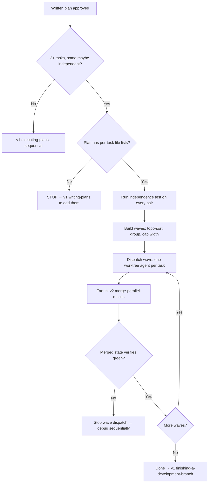

# parallel-plan-executor + verification-gate Implementation Plan

> **For agentic workers:** REQUIRED SUB-SKILL: Use superpowers:subagent-driven-development (recommended) or superpowers:executing-plans to implement this plan task-by-task. Steps use checkbox (`- [ ]`) syntax for tracking.

**Goal:** Build the two approved v2 candidates: the `parallel-plan-executor` skill (v2/skills/) and the `verification-gate` plugin (v2/plugins/), per their specs in `docs/superpowers/specs/2026-06-10-v2-candidates/`.

**Architecture:** The skill is a single SKILL.md following the established v2 house style (frontmatter with `tier`/`supports`, "Not this skill if" first, mermaid trigger flowchart, numbered pattern, Common mistakes, PROVEN BY). The plugin is a standard Claude Code plugin: `.claude-plugin/plugin.json` manifest, `hooks/hooks.json` wiring a PostToolUse tracker and a Stop gate (both bash + embedded python3, state in a per-session temp dir), one slash command, README. Default mode is `warn` per spec.

**Tech Stack:** Markdown skills, Claude Code plugin format, bash + python3 (stdlib only) hooks.

**Note:** This repo is not a git repository — "commit" steps are replaced by skill-lint/structural verification steps. Verification commands run from repo root `/Users/donalmoloney/PycharmProjects/ObraSuperPowersSupercharged`.

---

### Task 1: parallel-plan-executor skill

**Files:**
- Create: `v2/skills/parallel-plan-executor/SKILL.md`
- Modify: `v2/README.md` (Current skills table)

- [ ] **Step 1: Write the SKILL.md**

Full content:

````markdown
---
name: parallel-plan-executor
description: Use when a written plan has 3+ tasks and some may be independent — partitions tasks into parallel waves with a four-condition independence test, dispatches each wave into isolated worktree agents, and merges between waves.
author: Donal Moloney
tier: v2
supports: [writing-plans, executing-plans, dispatching-parallel-agents, using-git-worktrees]
type: process
chains-to: merge-parallel-results
pairs-with: context-sufficiency-check
---

## Not this skill if

- **The plan has fewer than 3 tasks, or the tasks form a strict chain** → execute sequentially with v1 **executing-plans**; wave overhead buys nothing.
- **The tasks are research or exploration, not code changes** → v1 **dispatching-parallel-agents** directly; no worktrees, no waves.
- **Agents have already returned and you need the fan-in** → that is v2 **merge-parallel-results**; this skill ends where it begins.
- **There is no written plan yet** → v1 **writing-plans** first; this skill consumes a plan, it never invents one.

# Parallel Plan Executor

## Purpose

v1 has every piece — plans (**writing-plans**), execution (**executing-plans**), parallel dispatch (**dispatching-parallel-agents**), isolation (**using-git-worktrees**) — but no bridge: nothing decides *which plan tasks may safely run in parallel*, dispatches them isolated, and reassembles between waves. Done ad hoc, the failure mode is two agents editing the same file, and it is expensive.

Supports v1 **writing-plans** by requiring per-task file lists from plans, v1 **executing-plans** by replacing its sequential walk when independent waves exist, v1 **dispatching-parallel-agents** by supplying the partitioning that skill assumes you already did, and v1 **using-git-worktrees** by putting every wave agent in its own worktree.

**Core principle:** Two tasks share a wave only when their independence is *proven from the plan* — any uncertainty means sequence, never parallel.

## Triggers



## The independence test

Two tasks may share a wave only if **ALL four** conditions hold. Check every pair in the candidate wave.

1. **No file overlap** — the sets of files each task is expected to touch are disjoint. Derive the sets from the plan's per-task file lists. If the plan lacks them, **STOP** and return to v1 **writing-plans** to add them — never infer file sets by guessing; inference is how collisions happen.
2. **No ordering** — neither task consumes the other's output: types, function signatures, API responses, migrations, generated code.
3. **No shared mutable resource** — no common test database, port, fixture file, cache, or environment the tasks both write.
4. **Independently verifiable** — each task's verification command can run green without the other task's changes present.

Any condition uncertain → the pair is **not** independent. Sequence it.

## Wave construction

1. Topologically sort tasks by their dependency edges (condition 2 failures define the edges).
2. Within each topological level, group tasks that pass the full independence test pairwise into one wave.
3. Cap wave width at **3 agents** (default) — merge cost grows with width faster than the time saved.
4. Tasks that fit no wave run sequentially between waves, exactly as v1 **executing-plans** would.

## Dispatch protocol

For each task in the wave:

1. One agent, **worktree-isolated** (v1 **using-git-worktrees** lifecycle rules apply — creation, naming, cleanup).
2. The dispatch prompt must pass v2 **context-sufficiency-check** before sending.
3. The prompt carries exactly: the single task text, its file list **as a boundary** ("touch only these files"), the task's verification command, and the result format v2 **merge-parallel-results** expects (findings + `files_touched`).
4. Dispatch the whole wave in one message so agents run concurrently.

## Fan-in between waves

1. Wave returns → v2 **merge-parallel-results** for dedupe, contradiction detection, and file-collision flagging.
2. Run the full verification suite on the merged state — per-task green is not wave green.
3. Only a green merged state unlocks the next wave.
4. If merge finds a collision despite the test: record **which of the four conditions was judged wrong**, then re-sequence the remainder of the plan — the plan's independence claims are now suspect.

## Failure handling

One agent fails while others succeed: merge the successes, then run the failed task **sequentially in the main session**, where it gets v1 **systematic-debugging**. Never re-dispatch a failed task into the next wave blind — that is the re-dispatch cap logic of v2 **context-sufficiency-check**.

## Common mistakes

❌ Guessing file sets when the plan doesn't list them.
✅ STOP and return to v1 **writing-plans** — the file list is the load-bearing input.

❌ Treating per-task green as wave green.
✅ Verify the *merged* state before the next wave; integration is where parallel work breaks.

❌ Widening waves to "go faster."
✅ Cap at 3; merge cost grows with width faster than the speedup.

❌ Re-dispatching a failed task into the next wave.
✅ Failed tasks come home: sequential execution with v1 **systematic-debugging**.

❌ Parallelizing a plan that is really a chain.
✅ If the topological sort yields width-1 levels everywhere, this skill exits to v1 **executing-plans**.

## Verification

Each wave produces a completion claim ("wave N merged and green"). Prove it before dispatching wave N+1, and chain the final state to v1 **verification-before-completion**.

PROVEN BY: a wave log showing, for every wave — the pairwise independence verdicts, the dispatch prompts' file boundaries, the merge artifact from v2 merge-parallel-results with an empty (or explicitly handled) collision list, and the green full-suite run on the merged state.
````

- [ ] **Step 2: Verify against skill-lint's seven checks**

Run from repo root:
```bash
S=v2/skills/parallel-plan-executor/SKILL.md
grep -c "^name: parallel-plan-executor$" $S        # expect 1  (check 1)
grep -c "^description: Use when" $S                 # expect 1  (check 2)
grep -c "^## Not this skill if" $S                  # expect 1  (check 3)
grep -cE "^[0-9]+\." $S                             # expect >=2 (check 4)
grep -ci "PROVEN BY" $S                             # expect >=1 (check 5)
grep -ciE "TODO|TBD|PLACEHOLDER|coming soon" $S     # expect 0  (check 6)
ls v1/writing-plans v1/executing-plans v1/dispatching-parallel-agents v1/using-git-worktrees v2/skills/merge-parallel-results v2/skills/context-sufficiency-check  # all exist (check 7)
```
Expected: all counts as annotated; ls lists all directories without error.

- [ ] **Step 3: Add the skill to the v2 README table**

In `v2/README.md`, add to the Current skills table (alphabetical position):
```markdown
| `parallel-plan-executor` | writing-plans, executing-plans, dispatching-parallel-agents, using-git-worktrees |
```

---

### Task 2: verification-gate plugin — manifest and hook wiring

**Files:**
- Create: `v2/plugins/verification-gate/.claude-plugin/plugin.json`
- Create: `v2/plugins/verification-gate/hooks/hooks.json`

- [ ] **Step 1: Write plugin.json**

```json
{
  "name": "verification-gate",
  "version": "0.1.0",
  "description": "Harness enforcement of v1 verification-before-completion: warns or blocks success claims until a verification command has run after the last edit. tier: v2.",
  "author": {
    "name": "Donal Moloney"
  }
}
```

- [ ] **Step 2: Write hooks/hooks.json**

```json
{
  "hooks": {
    "PostToolUse": [
      {
        "matcher": "Bash|Edit|Write",
        "hooks": [
          {
            "type": "command",
            "command": "\"${CLAUDE_PLUGIN_ROOT}/hooks/track-verification.sh\""
          }
        ]
      }
    ],
    "Stop": [
      {
        "hooks": [
          {
            "type": "command",
            "command": "\"${CLAUDE_PLUGIN_ROOT}/hooks/stop-gate.sh\""
          }
        ]
      }
    ]
  }
}
```

- [ ] **Step 3: Verify both parse as JSON**

```bash
python3 -m json.tool v2/plugins/verification-gate/.claude-plugin/plugin.json > /dev/null && echo OK
python3 -m json.tool v2/plugins/verification-gate/hooks/hooks.json > /dev/null && echo OK
```
Expected: `OK` twice.

---

### Task 3: verification-gate plugin — tracker hook

**Files:**
- Create: `v2/plugins/verification-gate/hooks/track-verification.sh` (mode 755)

- [ ] **Step 1: Write the tracker**

```bash
#!/bin/bash
# PostToolUse hook: timestamp edits and verification commands so the Stop
# gate can enforce "verification ran AFTER the last edit".
INPUT=$(cat)
python3 - "$INPUT" <<'PY'
import json, os, re, sys, time

data = json.loads(sys.argv[1])
session = data.get("session_id") or "default"
state = os.path.join(os.environ.get("TMPDIR", "/tmp"), "verification-gate", session)
os.makedirs(state, exist_ok=True)
now = repr(time.time())
tool = data.get("tool_name", "")

if tool in ("Edit", "Write"):
    with open(os.path.join(state, "last_edit"), "w") as f:
        f.write(now)
elif tool == "Bash":
    cmd = (data.get("tool_input") or {}).get("command", "")
    default = (r"pytest|npm (run )?test|yarn test|pnpm test|go test|cargo test"
               r"|make test|tox\b|rspec|phpunit|gradle test|mvn test|jest|vitest")
    if re.search(os.environ.get("VGATE_VERIFY_COMMANDS", default), cmd):
        with open(os.path.join(state, "last_verify"), "w") as f:
            f.write(now)
PY
exit 0
```

- [ ] **Step 2: Make executable and test edit-tracking**

```bash
chmod +x v2/plugins/verification-gate/hooks/track-verification.sh
rm -rf "${TMPDIR:-/tmp}/verification-gate/test-session"
echo '{"session_id":"test-session","tool_name":"Edit","tool_input":{"file_path":"/x.py"}}' \
  | v2/plugins/verification-gate/hooks/track-verification.sh
test -f "${TMPDIR:-/tmp}/verification-gate/test-session/last_edit" && echo EDIT-TRACKED
```
Expected: `EDIT-TRACKED`.

- [ ] **Step 3: Test verify-tracking (positive and negative)**

```bash
echo '{"session_id":"test-session","tool_name":"Bash","tool_input":{"command":"pytest -x"}}' \
  | v2/plugins/verification-gate/hooks/track-verification.sh
test -f "${TMPDIR:-/tmp}/verification-gate/test-session/last_verify" && echo VERIFY-TRACKED
rm -rf "${TMPDIR:-/tmp}/verification-gate/neg-session"
echo '{"session_id":"neg-session","tool_name":"Bash","tool_input":{"command":"ls -la"}}' \
  | v2/plugins/verification-gate/hooks/track-verification.sh
test ! -f "${TMPDIR:-/tmp}/verification-gate/neg-session/last_verify" && echo NEGATIVE-OK
```
Expected: `VERIFY-TRACKED` then `NEGATIVE-OK`.

---

### Task 4: verification-gate plugin — stop gate hook

**Files:**
- Create: `v2/plugins/verification-gate/hooks/stop-gate.sh` (mode 755)

- [ ] **Step 1: Write the gate**

```bash
#!/bin/bash
# Stop hook: when the last assistant message makes a success claim but no
# verification command has run since the last edit, warn (default) or block.
# VGATE_MODE=warn|block|off   VGATE_CLAIM_PATTERNS / VGATE_VERIFY_COMMANDS: regex overrides.
INPUT=$(cat)
MODE="${VGATE_MODE:-warn}"
[ "$MODE" = "off" ] && exit 0
python3 - "$INPUT" "$MODE" <<'PY'
import json, os, re, sys

data = json.loads(sys.argv[1])
mode = sys.argv[2]
session = data.get("session_id") or "default"
state = os.path.join(os.environ.get("TMPDIR", "/tmp"), "verification-gate", session)

def ts(name):
    try:
        with open(os.path.join(state, name)) as f:
            return float(f.read().strip())
    except Exception:
        return None

last_edit, last_verify = ts("last_edit"), ts("last_verify")
if last_edit is None:
    sys.exit(0)                       # nothing edited this session: nothing to gate
if last_verify is not None and last_verify > last_edit:
    sys.exit(0)                       # verified after the last edit: claim is backed

# Fire only on an actual success claim in the LAST assistant message —
# conservative patterns; false positives are the killer risk.
default = (r"\b(all tests pass(ing)?|tests? (now )?pass(ing)?|works now"
           r"|(is|are) fixed|fixed the \w+|implementation (is )?complete"
           r"|task (is )?(done|complete[d]?))\b")
claim = re.compile(os.environ.get("VGATE_CLAIM_PATTERNS", default), re.I)

text = ""
try:
    with open(data.get("transcript_path", "")) as f:
        for line in f:
            try:
                entry = json.loads(line)
            except Exception:
                continue
            if entry.get("type") == "assistant":
                content = (entry.get("message") or {}).get("content") or []
                parts = [c.get("text", "") for c in content
                         if isinstance(c, dict) and c.get("type") == "text"]
                if parts:
                    text = "\n".join(parts)
except Exception:
    sys.exit(0)                       # unreadable transcript: never false-block

if not claim.search(text):
    sys.exit(0)

msg = ("verification-gate: success claim without verification — no verify command "
       "has run since the last edit. Run the test/build command and show its output "
       "first (v1 verification-before-completion).")
if mode == "block":
    print(msg, file=sys.stderr)
    sys.exit(2)
print(msg)                            # warn mode: visible note, no block
sys.exit(0)
PY
```

- [ ] **Step 2: Make executable; test block on unverified claim**

```bash
chmod +x v2/plugins/verification-gate/hooks/stop-gate.sh
STATE="${TMPDIR:-/tmp}/verification-gate/gate-test"; rm -rf "$STATE"; mkdir -p "$STATE"
echo "100.0" > "$STATE/last_edit"          # edit at t=100, no verify
T=$(mktemp /tmp/transcript-XXXX.jsonl)
echo '{"type":"assistant","message":{"content":[{"type":"text","text":"All tests pass, we are done."}]}}' > "$T"
echo "{\"session_id\":\"gate-test\",\"transcript_path\":\"$T\"}" \
  | VGATE_MODE=block v2/plugins/verification-gate/hooks/stop-gate.sh
echo "exit=$?"
```
Expected: the gate message on stderr, then `exit=2`.

- [ ] **Step 3: Test pass when verification is newer than the edit**

```bash
echo "200.0" > "$STATE/last_verify"        # verify at t=200 > edit t=100
echo "{\"session_id\":\"gate-test\",\"transcript_path\":\"$T\"}" \
  | VGATE_MODE=block v2/plugins/verification-gate/hooks/stop-gate.sh
echo "exit=$?"
```
Expected: no message, `exit=0`.

- [ ] **Step 4: Test no-claim and warn-mode behavior**

```bash
rm "$STATE/last_verify"
echo '{"type":"assistant","message":{"content":[{"type":"text","text":"Still investigating the parser."}]}}' > "$T"
echo "{\"session_id\":\"gate-test\",\"transcript_path\":\"$T\"}" \
  | VGATE_MODE=block v2/plugins/verification-gate/hooks/stop-gate.sh; echo "no-claim exit=$?"
echo '{"type":"assistant","message":{"content":[{"type":"text","text":"All tests pass."}]}}' > "$T"
echo "{\"session_id\":\"gate-test\",\"transcript_path\":\"$T\"}" \
  | VGATE_MODE=warn v2/plugins/verification-gate/hooks/stop-gate.sh; echo "warn exit=$?"
```
Expected: `no-claim exit=0` (silent); then the gate message on stdout and `warn exit=0`.

---

### Task 5: verification-gate plugin — command and README

**Files:**
- Create: `v2/plugins/verification-gate/commands/verify-status.md`
- Create: `v2/plugins/verification-gate/README.md`
- Modify: `v2/README.md` (add a Current plugins table)

- [ ] **Step 1: Write the slash command**

```markdown
---
description: Show verification-gate state — last edit, last verification, and whether a completion claim would currently pass
---

Report the verification-gate state for this session:

1. Find the state directory: `ls "${TMPDIR:-/tmp}/verification-gate/"` and use the entry matching the current session (newest if unsure).
2. Read `last_edit` and `last_verify` in it (epoch timestamps; either may be absent).
3. Report a three-line status:
   - Last edit: <timestamp or "none">
   - Last verification: <timestamp + tracked command class, or "none">
   - Gate verdict: PASS if no edits yet, or verification is newer than the last edit; otherwise FAIL — a completion claim would be flagged (mode: $VGATE_MODE, default warn).
4. If the verdict is FAIL, name the fix: run the project's verification command, then re-check.
```

- [ ] **Step 2: Write the plugin README**

```markdown
# verification-gate (v2 plugin)

Harness enforcement of v1 **verification-before-completion**: a Stop hook flags
success claims ("all tests pass", "fixed", "done") made when no verification
command has run since the last file edit. A PostToolUse hook keeps the
edit/verify timestamps. Spec: `docs/superpowers/specs/2026-06-10-v2-candidates/01-verification-gate.md`.

tier: v2 · supports: verification-before-completion, test-driven-development · pairs-with: v2 loop-until-green

## Components

| Part | Role |
|---|---|
| `hooks/track-verification.sh` | PostToolUse (Bash/Edit/Write): timestamps edits and verify commands per session |
| `hooks/stop-gate.sh` | Stop: compares timestamps, scans last assistant message for claims, warns or blocks |
| `commands/verify-status.md` | `/verify-status`: prints gate state and verdict |

## Configuration (environment variables)

| Var | Default | Meaning |
|---|---|---|
| `VGATE_MODE` | `warn` | `warn` prints a note; `block` exits 2 (blocks the stop); `off` disables |
| `VGATE_VERIFY_COMMANDS` | common test runners | regex of Bash commands that count as verification |
| `VGATE_CLAIM_PATTERNS` | conservative claim set | regex of success-claim phrases that arm the gate |

Start in `warn` (the default) and tune the regexes on real sessions before
switching to `block` — false positives are the failure mode that gets
enforcement hooks uninstalled.

## Verification

PROVEN BY: the four hook tests in the implementation plan — unverified claim
blocks with exit 2, verified claim passes, non-claim message passes, warn mode
prints without blocking.
```

- [ ] **Step 3: Add a plugins table to v2/README.md**

Append after the Current skills table:

```markdown
## Current plugins

| Plugin | Supports (v1) | Components |
|---|---|---|
| `verification-gate` | verification-before-completion, test-driven-development | Stop + PostToolUse hooks, `/verify-status` command |
```

Also add `parallel-plan-executor` to the skills table if Task 1 Step 3 has not already done it.

---

### Task 6: Cross-references and final audit

**Files:**
- Modify: `docs/superpowers/specs/2026-06-10-v2-candidates/01-verification-gate.md` (status line)
- Modify: `docs/superpowers/specs/2026-06-10-v2-candidates/04-parallel-plan-executor.md` (status line)

- [ ] **Step 1: Flip both spec statuses**

In each spec's header table change `| Status | proposed |` (or `proposed — **recommended first pick**`) to `| Status | built 2026-06-10 — see v2/ |`.

- [ ] **Step 2: Run the skill-auditor agent**

Dispatch the project `skill-auditor` agent on `v2/skills/parallel-plan-executor/` and `v2/plugins/verification-gate/` (per project CLAUDE.md: auditor runs on any new or changed skill before committing). Expected: findings list; fix any FAIL-level findings and re-verify with the Task 1 Step 2 / Task 4 test commands.

- [ ] **Step 3: Final structural sweep**

```bash
find v2/skills/parallel-plan-executor v2/plugins/verification-gate -type f | sort
grep -riE "TODO|TBD|PLACEHOLDER" v2/skills/parallel-plan-executor v2/plugins/verification-gate || echo CLEAN
```
Expected: 6 files listed (SKILL.md, plugin.json, hooks.json, two .sh, verify-status.md, README.md — 7 with plugin README); `CLEAN`.
