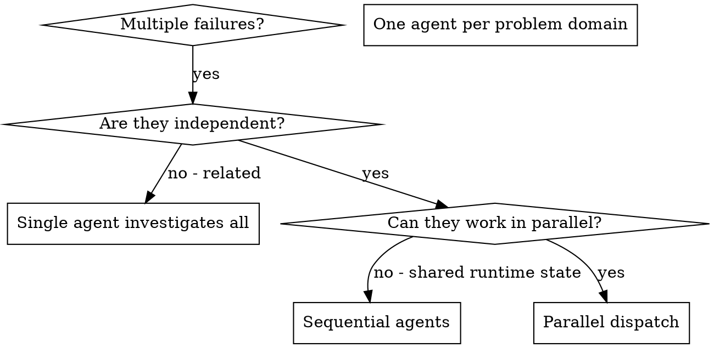

# Dispatching Parallel Agents

## Overview

You delegate tasks to specialized agents with isolated context. By precisely crafting their instructions and context, you ensure they stay focused and succeed at their task. They should never inherit your session's context or history — you construct exactly what they need. This also preserves your own context for coordination work.

When you have multiple unrelated failures (different test files, different subsystems, different bugs), investigating them sequentially wastes time. Each investigation is independent and can happen in parallel.

**Core principle:** Dispatch one agent per independent problem domain. Let them work concurrently.

## Handoff

**Entry condition:** You have 2+ problem domains already judged independent — typically handed off from systematic-debugging (multiple unrelated root causes) or a failing test suite grouped by subsystem.

**Exit:** When all agent results are merged and the full suite is green, invoke verification-before-completion. If the work is on a feature branch, finishing-a-development-branch follows from there.

## When to Use



**Use when:**
- 3+ test files failing with different root causes
- Multiple subsystems broken independently
- Each problem can be understood without context from others
- No shared state between investigations

**Don't use when:**
- Failures are related (fix one might fix others)
- Need to understand full system state
- Agents would interfere through shared *runtime* state that worktrees can't isolate (same live database, same port, same external service) — worktree isolation already removes file-level interference

## The Pattern

### 1. Identify Independent Domains

Group failures by what's broken:
- File A tests: Tool approval flow
- File B tests: Batch completion behavior
- File C tests: Abort functionality

Each domain is independent - fixing tool approval doesn't affect abort tests.

### 2. Create Focused Agent Tasks

Each agent gets:
- **Specific scope:** One test file or subsystem
- **Clear goal:** Make these tests pass
- **Constraints:** Don't change other code
- **Expected output:** Summary of what you found and fixed

### 3. Dispatch in Parallel (Harness-Native)

Use the harness's real concurrency semantics — in Claude Code, that means
**multiple Agent calls in a single message**. One call per message gives you
serial agents; one message containing N calls gives you true concurrency.

```typescript
// One message, three Agent calls — all run concurrently
Agent("Fix agent-tool-abort.test.ts failures", { isolation: "worktree" })
Agent("Fix batch-completion-behavior.test.ts failures", { isolation: "worktree" })
Agent("Fix tool-approval-race-conditions.test.ts failures", { isolation: "worktree" })
```

**`isolation: "worktree"`** — every agent that writes files gets its own git
worktree. The harness provisions a fresh worktree per agent, so agents
physically cannot clobber each other's edits; any overlap surfaces later as an
explicit merge conflict instead of silent interference. Read-only agents
(research, audit) don't need it.

**`run_in_background: true`** — for long investigations, dispatch in the
background and keep coordinating. Collect the agent's output when it finishes
instead of blocking your own context on it.

### 4. Review and Integrate

When agents return:
- Read each summary
- Merge each agent's worktree branch back **one at a time** — overlap surfaces
  as a git merge conflict implicating that specific agent, not the whole batch
- Run full test suite after the final merge
- Integrate all changes

### 5. Continue, Don't Re-Dispatch Cold

If a returned agent's result is incomplete or raises follow-up questions, use
**SendMessage to continue that agent** — it still holds its full investigation
context. Re-dispatching a fresh agent throws that context away and pays for the
re-derivation. Only dispatch fresh when the original agent went down a wrong
path you need to discard entirely.

## Agent Prompt Structure

Good agent prompts are:
1. **Focused** - One clear problem domain
2. **Self-contained** - All context needed to understand the problem
3. **Specific about output** - What should the agent return?

```markdown
Fix the 3 failing tests in src/agents/agent-tool-abort.test.ts:

1. "should abort tool with partial output capture" - expects 'interrupted at' in message
2. "should handle mixed completed and aborted tools" - fast tool aborted instead of completed
3. "should properly track pendingToolCount" - expects 3 results but gets 0

These are timing/race condition issues. Your task:

1. Read the test file and understand what each test verifies
2. Identify root cause - timing issues or actual bugs?
3. Fix by:
   - Replacing arbitrary timeouts with event-based waiting
   - Fixing bugs in abort implementation if found
   - Adjusting test expectations if testing changed behavior

Do NOT just increase timeouts - find the real issue.

Return: Summary of what you found and what you fixed.
```

## Common Mistakes

**❌ Too broad:** "Fix all the tests" - agent gets lost
**✅ Specific:** "Fix agent-tool-abort.test.ts" - focused scope

**❌ No context:** "Fix the race condition" - agent doesn't know where
**✅ Context:** Paste the error messages and test names

**❌ No constraints:** Agent might refactor everything
**✅ Constraints:** "Do NOT change production code" or "Fix tests only"

**❌ Vague output:** "Fix it" - you don't know what changed
**✅ Specific:** "Return summary of root cause and changes"

## Fallback: Other Harnesses

If your harness lacks Agent isolation options, background dispatch, or agent messaging:

- **Concurrency:** Use whatever batched task primitive exists (e.g. multiple `Task("...")` calls in one turn). If nothing runs concurrently, dispatch sequentially — the one-domain-per-agent split still pays off in focus and context isolation.
- **Isolation:** Create worktrees manually (`git worktree add ../wt-<domain> -b agent/<domain>`) and pin each write-agent to its own worktree path in the prompt.
- **Continuation:** If you can't message a returned agent, re-dispatch with the agent's full summary pasted into the new prompt as context.

## When NOT to Use

**Related failures:** Fixing one might fix others - investigate together first
**Need full context:** Understanding requires seeing entire system
**Exploratory debugging:** You don't know what's broken yet
**Shared runtime state:** `isolation: "worktree"` removes file-level interference, but agents still collide on a shared live database, port, or external service — serialize those

## Real Example from Session

**Scenario:** 6 test failures across 3 files after major refactoring

**Failures:**
- agent-tool-abort.test.ts: 3 failures (timing issues)
- batch-completion-behavior.test.ts: 2 failures (tools not executing)
- tool-approval-race-conditions.test.ts: 1 failure (execution count = 0)

**Decision:** Independent domains - abort logic separate from batch completion separate from race conditions

**Dispatch:**
```
Agent 1 → Fix agent-tool-abort.test.ts
Agent 2 → Fix batch-completion-behavior.test.ts
Agent 3 → Fix tool-approval-race-conditions.test.ts
```

**Results:**
- Agent 1: Replaced timeouts with event-based waiting
- Agent 2: Fixed event structure bug (threadId in wrong place)
- Agent 3: Added wait for async tool execution to complete

**Integration:** All fixes independent, no conflicts, full suite green

**Time saved:** 3 problems solved in parallel vs sequentially

## Key Benefits

1. **Parallelization** - Multiple investigations happen simultaneously
2. **Focus** - Each agent has narrow scope, less context to track
3. **Independence** - Agents don't interfere with each other
4. **Speed** - 3 problems solved in time of 1

## Verification

After agents return:
1. **Review each summary** - Understand what changed
2. **Merge worktrees one at a time** - Overlap shows up as a git conflict naming the offending agent; resolve before the next merge
3. **Run full suite** - Verify all fixes work together
4. **Spot check** - Agents can make systematic errors

## Real-World Impact

From debugging session (2025-10-03):
- 6 failures across 3 files
- 3 agents dispatched in parallel
- All investigations completed concurrently
- All fixes integrated successfully
- Zero conflicts between agent changes

## Supercharged vs upstream

Adopted **Option A — Harness-native dispatch** (recommended option, adopted 2026-06-11) from `v1/SUPERCHARGING-OPTIONS.md`. Changes vs the verbatim obra/superpowers 5.1.0 skill:

- **Dispatch rewritten around real Claude Code semantics** (was a generic `Task("...")` sketch): multiple Agent calls in a single message for true concurrency, `isolation: "worktree"` per write-agent, and `run_in_background` for long investigations. *Why:* the skill's value is parallelism, and the upstream text didn't show how to actually obtain it in the harness.
- **New step 5 — SendMessage continuation:** continue a returned agent instead of re-dispatching cold, preserving its investigation context. *Why:* cold re-dispatch silently pays the full re-derivation cost.
- **Integration and Verification updated for worktrees:** merge agent branches one at a time so overlap surfaces as a git conflict implicating one specific agent (was "review and hope" conflict checking).
- **Shared-state caveats narrowed** in the flowchart, "Don't use when", and "When NOT to Use": worktree isolation removes file-level interference mechanically, so only shared *runtime* state (live database, port, external service) still forces serialization. *Why:* the upstream "agents interfere" caveat is largely obsolete under worktree isolation — a step-change, not a polish.
- **New Handoff section (CC2 — explicit handoff states):** entry condition (2+ independent domains, typically from systematic-debugging) and exit skill (verification-before-completion, then finishing-a-development-branch).
- **New Fallback section for other harnesses** (the option's stated trade-off is platform coupling): batched-task concurrency, manual `git worktree add` isolation, and summary-paste re-dispatch when agent messaging is unavailable.
