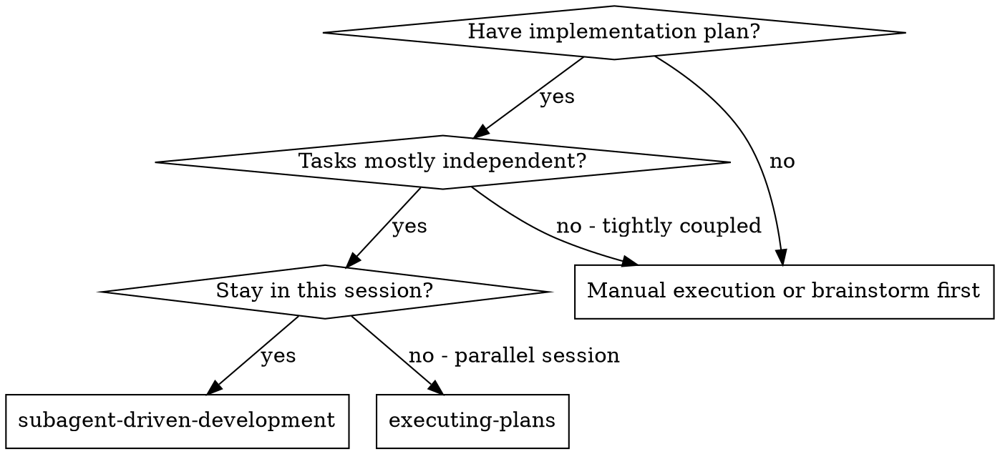

# Subagent-Driven Development

Execute plan by dispatching fresh subagent per task, with two-stage review after each: spec compliance review first, then code quality review.

**Why subagents:** You delegate tasks to specialized agents with isolated context. By precisely crafting their instructions and context, you ensure they stay focused and succeed at their task. They should never inherit your session's context or history — you construct exactly what they need. This also preserves your own context for coordination work.

**Core principle:** Fresh subagent per task + two-stage review (spec then quality) = high quality, fast iteration. Independent tasks run as concurrent waves — serial execution is just a wave of one, not a law.

**Continuous execution:** Do not pause to check in with your human partner between tasks. Execute all tasks from the plan without stopping. The only reasons to stop are: BLOCKED status you cannot resolve, ambiguity that genuinely prevents progress, or all tasks complete. "Should I continue?" prompts and progress summaries waste their time — they asked you to execute the plan, so execute it.

## Handoff

**Entry condition:** You have an approved implementation plan (from superpowers:writing-plans) and a dedicated branch or worktree (superpowers:using-git-worktrees). No plan, no dispatch.

**Exit:** After the final whole-implementation code review passes, invoke superpowers:finishing-a-development-branch.

## When to Use



**vs. Executing Plans (parallel session):**
- Same session (no context switch)
- Fresh subagent per task (no context pollution)
- Two-stage review after each task: spec compliance first, then code quality
- Faster iteration (no human-in-loop between tasks)

## The Process

```dot
digraph process {
    rankdir=TB;

    subgraph cluster_per_task {
        label="Per Task (runs for each task in the current wave)";
        "Dispatch implementer subagent (./implementer-prompt.md)" [shape=box];
        "Implementer subagent asks questions?" [shape=diamond];
        "Answer questions, provide context" [shape=box];
        "Implementer subagent implements, tests, commits, self-reviews" [shape=box];
        "Dispatch spec reviewer subagent (./spec-reviewer-prompt.md)" [shape=box];
        "Spec reviewer subagent confirms code matches spec?" [shape=diamond];
        "Implementer subagent fixes spec gaps" [shape=box];
        "Dispatch code quality reviewer subagent (./code-quality-reviewer-prompt.md)" [shape=box];
        "Code quality reviewer subagent approves?" [shape=diamond];
        "Implementer subagent fixes quality issues" [shape=box];
        "Mark task complete in TodoWrite" [shape=box];
    }

    "Read plan, extract all tasks with full text, note context, create TodoWrite" [shape=box];
    "Build task dependency graph, group independent tasks into waves" [shape=box];
    "Dispatch current wave: one implementer per task, concurrently (worktree isolation if files overlap)" [shape=box];
    "All tasks in wave complete?" [shape=diamond];
    "Merge wave worktree branches one at a time, run full test suite" [shape=box];
    "More waves remain?" [shape=diamond];
    "Dispatch final code reviewer subagent for entire implementation" [shape=box];
    "Use superpowers:finishing-a-development-branch" [shape=box style=filled fillcolor=lightgreen];

    "Read plan, extract all tasks with full text, note context, create TodoWrite" -> "Build task dependency graph, group independent tasks into waves";
    "Build task dependency graph, group independent tasks into waves" -> "Dispatch current wave: one implementer per task, concurrently (worktree isolation if files overlap)";
    "Dispatch current wave: one implementer per task, concurrently (worktree isolation if files overlap)" -> "Dispatch implementer subagent (./implementer-prompt.md)" [label="per task in wave"];
    "Dispatch implementer subagent (./implementer-prompt.md)" -> "Implementer subagent asks questions?";
    "Implementer subagent asks questions?" -> "Answer questions, provide context" [label="yes"];
    "Answer questions, provide context" -> "Dispatch implementer subagent (./implementer-prompt.md)";
    "Implementer subagent asks questions?" -> "Implementer subagent implements, tests, commits, self-reviews" [label="no"];
    "Implementer subagent implements, tests, commits, self-reviews" -> "Dispatch spec reviewer subagent (./spec-reviewer-prompt.md)";
    "Dispatch spec reviewer subagent (./spec-reviewer-prompt.md)" -> "Spec reviewer subagent confirms code matches spec?";
    "Spec reviewer subagent confirms code matches spec?" -> "Implementer subagent fixes spec gaps" [label="no"];
    "Implementer subagent fixes spec gaps" -> "Dispatch spec reviewer subagent (./spec-reviewer-prompt.md)" [label="re-review"];
    "Spec reviewer subagent confirms code matches spec?" -> "Dispatch code quality reviewer subagent (./code-quality-reviewer-prompt.md)" [label="yes"];
    "Dispatch code quality reviewer subagent (./code-quality-reviewer-prompt.md)" -> "Code quality reviewer subagent approves?";
    "Code quality reviewer subagent approves?" -> "Implementer subagent fixes quality issues" [label="no"];
    "Implementer subagent fixes quality issues" -> "Dispatch code quality reviewer subagent (./code-quality-reviewer-prompt.md)" [label="re-review"];
    "Code quality reviewer subagent approves?" -> "Mark task complete in TodoWrite" [label="yes"];
    "Mark task complete in TodoWrite" -> "All tasks in wave complete?";
    "All tasks in wave complete?" -> "Dispatch spec reviewer subagent (./spec-reviewer-prompt.md)" [label="no - review next returned implementer"];
    "All tasks in wave complete?" -> "Merge wave worktree branches one at a time, run full test suite" [label="yes"];
    "Merge wave worktree branches one at a time, run full test suite" -> "More waves remain?";
    "More waves remain?" -> "Dispatch current wave: one implementer per task, concurrently (worktree isolation if files overlap)" [label="yes"];
    "More waves remain?" -> "Dispatch final code reviewer subagent for entire implementation" [label="no"];
    "Dispatch final code reviewer subagent for entire implementation" -> "Use superpowers:finishing-a-development-branch";
}
```



## Wave Planning

Before dispatching anything, turn the plan's task list into a dependency graph, then into waves.

**1. Build the dependency graph.** For each task, record two things from the plan text:
- **Depends on:** tasks whose output this task consumes — explicit "depends on Task N" notes, plus implicit dependencies (Task B calls an API Task A creates, Task C tests behavior Task B implements).
- **Files in scope:** the files the task will create or modify, as best the plan reveals.

**2. Group into waves.** A wave is the set of tasks whose dependencies are all complete. Wave 1 is every task with no dependencies; each later wave unlocks as its prerequisites land. **When you cannot tell whether two tasks are independent, treat them as dependent** — a wrongly serialized task costs a little time; a wrongly parallelized one costs a merge mess.

**3. Dispatch the wave concurrently.** Use the machinery from **superpowers:dispatching-parallel-agents**: multiple Agent calls in a single message for true concurrency.
- **Disjoint file sets:** dispatch directly into the shared branch.
- **Overlapping or uncertain file sets:** give each implementer `isolation: "worktree"` so they physically cannot clobber each other; overlap surfaces later as an explicit merge conflict naming the offending task.
- **Cap wave width** at what you can actually orchestrate (3–4 implementers). You must still answer each implementer's questions and run two reviews per task; beyond that, your coordination becomes the bottleneck and quality slips.

**4. Review as implementers return.** Each returned task gets the full two-stage review (spec, then quality) individually — reviews of finished tasks proceed while other implementers in the wave are still working. Review load spikes at wave boundaries; reviews stay serial from your side, and that's fine.

**5. Close the wave.** A wave is complete when every task in it has passed both reviews. Then merge any worktree branches back **one at a time** (a conflict implicates one specific task — fix it via its implementer, not by hand), and run the full test suite before opening the next wave. Never start wave N+1 with wave N unmerged or red.

**Degenerate case:** a fully linear plan produces waves of one task each — which is exactly the upstream serial process. Serial is the special case, not the rule.

## Model Selection

Use the least powerful model that can handle each role to conserve cost and increase speed.

**Mechanical implementation tasks** (isolated functions, clear specs, 1-2 files): use a fast, cheap model. Most implementation tasks are mechanical when the plan is well-specified.

**Integration and judgment tasks** (multi-file coordination, pattern matching, debugging): use a standard model.

**Architecture, design, and review tasks**: use the most capable available model.

**Task complexity signals:**
- Touches 1-2 files with a complete spec → cheap model
- Touches multiple files with integration concerns → standard model
- Requires design judgment or broad codebase understanding → most capable model

## Handling Implementer Status

Implementer subagents report one of four statuses. Handle each appropriately:

**DONE:** Proceed to spec compliance review.

**DONE_WITH_CONCERNS:** The implementer completed the work but flagged doubts. Read the concerns before proceeding. If the concerns are about correctness or scope, address them before review. If they're observations (e.g., "this file is getting large"), note them and proceed to review.

**NEEDS_CONTEXT:** The implementer needs information that wasn't provided. Provide the missing context and re-dispatch.

**BLOCKED:** The implementer cannot complete the task. Assess the blocker:
1. If it's a context problem, provide more context and re-dispatch with the same model
2. If the task requires more reasoning, re-dispatch with a more capable model
3. If the task is too large, break it into smaller pieces
4. If the plan itself is wrong, escalate to the human

**Never** ignore an escalation or force the same model to retry without changes. If the implementer said it's stuck, something needs to change.

## Prompt Templates

- `./implementer-prompt.md` - Dispatch implementer subagent
- `./spec-reviewer-prompt.md` - Dispatch spec compliance reviewer subagent
- `./code-quality-reviewer-prompt.md` - Dispatch code quality reviewer subagent

## Example Workflow

```
You: I'm using Subagent-Driven Development to execute this plan.

[Read plan file once: docs/superpowers/plans/feature-plan.md]
[Extract all 5 tasks with full text and context]
[Build dependency graph: Task 2 depends on Task 1 (serial); Tasks 3 and 4 are
 independent with disjoint files → wave of two, dispatched concurrently after Task 2]
[Create TodoWrite with all tasks]

Task 1: Hook installation script

[Get Task 1 text and context (already extracted)]
[Dispatch implementation subagent with full task text + context]

Implementer: "Before I begin - should the hook be installed at user or system level?"

You: "User level (~/.config/superpowers/hooks/)"

Implementer: "Got it. Implementing now..."
[Later] Implementer:
  - Implemented install-hook command
  - Added tests, 5/5 passing
  - Self-review: Found I missed --force flag, added it
  - Committed

[Dispatch spec compliance reviewer]
Spec reviewer: ✅ Spec compliant - all requirements met, nothing extra

[Get git SHAs, dispatch code quality reviewer]
Code reviewer: Strengths: Good test coverage, clean. Issues: None. Approved.

[Mark Task 1 complete]

Task 2: Recovery modes

[Get Task 2 text and context (already extracted)]
[Dispatch implementation subagent with full task text + context]

Implementer: [No questions, proceeds]
Implementer:
  - Added verify/repair modes
  - 8/8 tests passing
  - Self-review: All good
  - Committed

[Dispatch spec compliance reviewer]
Spec reviewer: ❌ Issues:
  - Missing: Progress reporting (spec says "report every 100 items")
  - Extra: Added --json flag (not requested)

[Implementer fixes issues]
Implementer: Removed --json flag, added progress reporting

[Spec reviewer reviews again]
Spec reviewer: ✅ Spec compliant now

[Dispatch code quality reviewer]
Code reviewer: Strengths: Solid. Issues (Important): Magic number (100)

[Implementer fixes]
Implementer: Extracted PROGRESS_INTERVAL constant

[Code reviewer reviews again]
Code reviewer: ✅ Approved

[Mark Task 2 complete]

...

[After all tasks]
[Dispatch final code-reviewer]
Final reviewer: All requirements met, ready to merge

Done!
```

## Advantages

**vs. Manual execution:**
- Subagents follow TDD naturally
- Fresh context per task (no confusion)
- Parallel-safe (subagents don't interfere)
- Subagent can ask questions (before AND during work)

**vs. Executing Plans:**
- Same session (no handoff)
- Continuous progress (no waiting)
- Review checkpoints automatic
- Independent tasks execute concurrently in waves (throughput scales with the plan's parallelism)

**Efficiency gains:**
- No file reading overhead (controller provides full text)
- Controller curates exactly what context is needed
- Subagent gets complete information upfront
- Questions surfaced before work begins (not after)

**Quality gates:**
- Self-review catches issues before handoff
- Two-stage review: spec compliance, then code quality
- Review loops ensure fixes actually work
- Spec compliance prevents over/under-building
- Code quality ensures implementation is well-built

**Cost:**
- More subagent invocations (implementer + 2 reviewers per task)
- Controller does more prep work (extracting all tasks upfront)
- Review loops add iterations
- But catches issues early (cheaper than debugging later)

## Red Flags

**Never:**
- Start implementation on main/master branch without explicit user consent
- Skip reviews (spec compliance OR code quality)
- Proceed with unfixed issues
- Dispatch implementers in parallel without a dependency graph (same-wave tasks must be independent; overlapping-file tasks need worktree isolation or serialization)
- Start the next wave while the current wave has unmerged worktree branches or a red test suite
- Make subagent read plan file (provide full text instead)
- Skip scene-setting context (subagent needs to understand where task fits)
- Ignore subagent questions (answer before letting them proceed)
- Accept "close enough" on spec compliance (spec reviewer found issues = not done)
- Skip review loops (reviewer found issues = implementer fixes = review again)
- Let implementer self-review replace actual review (both are needed)
- **Start code quality review before spec compliance is ✅** (wrong order)
- Move to next task while either review has open issues

**If subagent asks questions:**
- Answer clearly and completely
- Provide additional context if needed
- Don't rush them into implementation

**If reviewer finds issues:**
- Implementer (same subagent) fixes them
- Reviewer reviews again
- Repeat until approved
- Don't skip the re-review

**If subagent fails task:**
- Dispatch fix subagent with specific instructions
- Don't try to fix manually (context pollution)

## Integration

**Required workflow skills:**
- **superpowers:using-git-worktrees** - Ensures isolated workspace (creates one or verifies existing)
- **superpowers:dispatching-parallel-agents** - Concurrency and worktree-isolation machinery for dispatching a wave (multiple Agent calls in one message, `isolation: "worktree"`, merge one branch at a time)
- **superpowers:writing-plans** - Creates the plan this skill executes
- **superpowers:requesting-code-review** - Code review template for reviewer subagents
- **superpowers:finishing-a-development-branch** - Complete development after all tasks

**Subagents should use:**
- **superpowers:test-driven-development** - Subagents follow TDD for each task

**Alternative workflow:**
- **superpowers:executing-plans** - Use for parallel session instead of same-session execution

## Supercharged vs upstream

Adopted **Option A — Parallel waves** (recommended option, adopted 2026-06-11) from `v1/SUPERCHARGING-OPTIONS.md`. Changes vs the verbatim obra/superpowers 5.1.0 skill:

- **New "Wave Planning" section** — the core of the option: build a task dependency graph from the plan (explicit "depends on" notes, implicit data-flow dependencies, files in scope), group independent tasks into waves, dispatch each wave concurrently via the superpowers:dispatching-parallel-agents machinery (multiple Agent calls in one message), with `isolation: "worktree"` for same-wave tasks whose file sets overlap or are uncertain. Wave boundary discipline: every task passes both reviews, worktree branches merge one at a time, full suite green before the next wave. *Why:* throughput — upstream's blanket serial rule wasted the plan's parallelism; the wave model makes serial execution the degenerate case (waves of one), not a law.
- **Process flowchart restructured around waves:** dependency-graph + wave-grouping step after plan reading, concurrent wave dispatch feeding the unchanged per-task lifecycle, and a wave-close step (merge one at a time, full suite) before the next wave or final review. The per-task implement → spec-review → quality-review cluster is verbatim upstream — reviews are per-task and unweakened.
- **Serial red flag rewritten:** upstream's "Never dispatch multiple implementation subagents in parallel (conflicts)" became "never dispatch in parallel *without a dependency graph*"; added a new red flag forbidding opening wave N+1 with wave N unmerged or red. *Why:* the old rule's real content was conflict avoidance, which the graph plus worktree isolation now handles mechanically; the trade-offs the option names (merge complexity, review-load spikes) are answered by one-at-a-time merges, a 3–4 implementer wave-width cap, and serial reviews.
- **New "Handoff" section (CC2 — explicit handoff states):** entry condition (approved plan from writing-plans, dedicated branch/worktree from using-git-worktrees) and exit skill (finishing-a-development-branch after the final review).
- **Small consistency edits:** core principle line notes waves, example workflow shows the dependency-graph step (Task 2 depends on Task 1; Tasks 3–4 form a wave), Advantages notes wave throughput, Integration lists superpowers:dispatching-parallel-agents as the wave-dispatch machinery (composition the tracker recommendation calls out explicitly).

Prompt templates (`implementer-prompt.md`, `spec-reviewer-prompt.md`, `code-quality-reviewer-prompt.md`) are untouched — the per-task contract is identical; only the scheduling above it changed. No scripts shipped: Option A cites CC2, not CC3.
