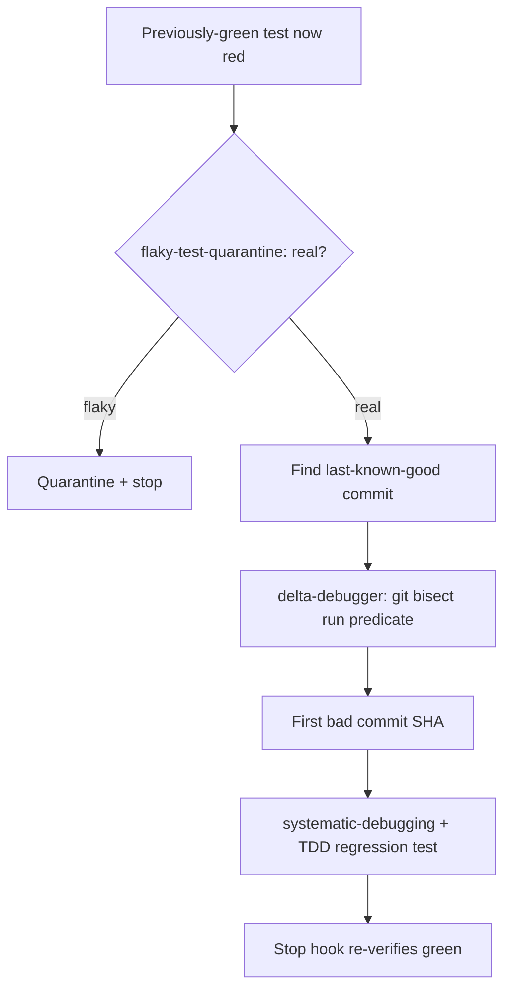

## Not this skill if

- The failure is **flaky / nondeterministic** — classify it first with v2 **flaky-test-quarantine** (`v2/skills/flaky-test-quarantine/`). Bisect needs a deterministic pass/fail signal or it mislocalizes.
- The introducing commit is already known — skip localization; go straight to v1 **systematic-debugging** Phase 1 with that SHA.
- The failing **input** is the large/unknown thing, not the commit — that is v2 **delta-debugger** (ddmin shrinks the input).
- The project has no usable commit history or no last-known-good commit — `git bisect` has nothing to search; fall back to v1 **systematic-debugging**.

# Bisect The Regression

## Purpose

A regression is "it worked before, it's broken now." The single highest-value fact is **which commit introduced it** — that commit's diff is the shortest path to the cause. This skill is the **regression-specific wrapper** around v2 **delta-debugger**'s bisect procedure: it establishes the good→bad window, confirms the failure is real, delegates the actual `git bisect run` to delta-debugger, and routes the bad commit into the fix and the plugin's mechanical re-verify.

**Boundary:** the bisect *machinery* — predicate script, the exit-1-on-HEAD / exit-0-on-good sanity check, `git bisect run`, the parent-good/child-bad two-point confirmation, `git bisect reset` — lives in v2 **delta-debugger** and is **not restated here**. delta-debugger minimizes input (ddmin) *or* history (bisect) from a clean predicate; this skill adds the *regression context* delta-debugger assumes you already have: how to find the last-known-good commit, the workflow ordering, and the plugin's hook integration.

## Triggers

**Use when:**
- A previously-passing test now fails the same way on every run
- "This used to work" / "what broke it?" / "when did this regress?"
- You have (or can find) a last-known-good commit and a broken HEAD

**Don't use when:**
- The failure is flaky (classify with flaky-test-quarantine first)
- The introducing commit is already known
- The failing input — not the commit — is what needs shrinking (delta-debugger)

## The pattern

### 1. Confirm it's a real regression, not flaky

Run v2 **flaky-test-quarantine** first. A predicate that sometimes passes and sometimes fails on the same commit breaks bisect's monotonicity assumption and mislocalizes.

### 2. Establish the good→bad window — *this skill's core add*

delta-debugger assumes you already hold a last-known-good SHA; for a regression you usually have to *find* it:

- the commit at the **last green CI run**, the last release tag, or the last passing nightly
- `git log --oneline -- <path/to/test-or-feature>` to see where the area last changed
- when unsure, pick an older commit you are confident was good — delta-debugger's two-point check will widen the range backward if it turns out already broken

`HEAD` (or the first red CI commit) is `bad`.

### 3. Delegate the bisect to delta-debugger

Hand the predicate script and the good/bad window to v2 **delta-debugger**'s localize-with-bisect procedure. Do not re-implement it here — its predicate sanity check, `git bisect run`, two-point confirmation, and `git bisect reset` are the authoritative mechanics.

### 4. Route the result

- Bad commit SHA + diff → v1 **systematic-debugging** Phase 1 as the prime evidence.
- Pin the regression with a failing test via v1 **test-driven-development** (RED) — the permanent guard.
- The plugin's `Stop` verifier hook re-runs the suite mechanically after the fix; iterate with v2 **loop-until-green** if it takes multiple rounds.

## Pitfalls

| ❌ Anti-pattern | ✅ Correct |
|---|---|
| Bisecting a flaky failure | Classify real first (flaky-test-quarantine); a flaky predicate mislocalizes |
| Re-teaching / forking the bisect mechanics here | Delegate to delta-debugger; this skill owns only the regression window + workflow |
| Guessing a "good" commit that is already broken | Let delta-debugger's two-point check catch it and widen backward |
| Stopping at the SHA | The SHA is evidence, not a fix — hand to systematic-debugging and pin with TDD |

## After

PROVEN BY:
- Real-not-flaky confirmed (flaky-test-quarantine verdict)
- good→bad window: good `<sha>` / bad `<sha>`
- delta-debugger bisect result: first bad commit `<SHA>` — "`<commit message>`"
- Regression pinned by a failing test at `<path>`; `Stop` hook re-verified green

Localization claims without `PROVEN BY:` are invalid under this skill.
