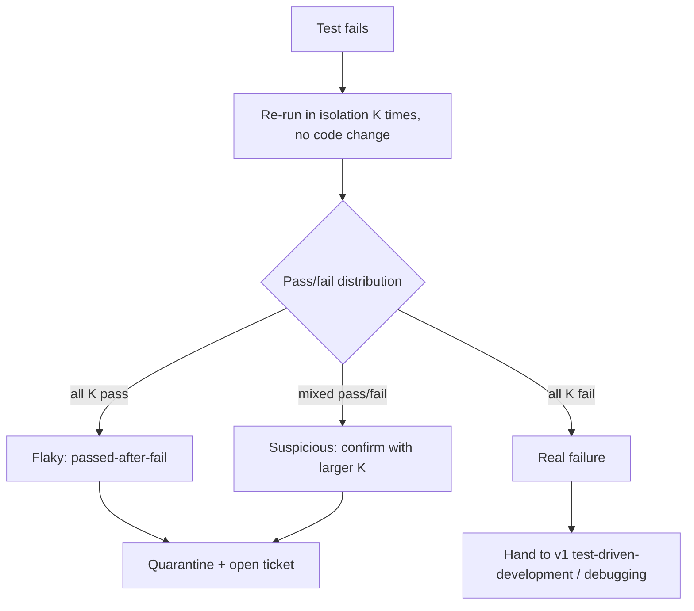

## Not this skill if

- The failure is deterministic and reproduces every run — go straight to v1 **test-driven-development** / debugging; there is nothing to quarantine.
- You already have a known-flaky ticket for this test — skip it per the quarantine record and move on; don't re-litigate.

# Flaky Test Quarantine

## Purpose

A failing test is a fork in the road, not a verdict. Classify the failure as **flaky** (nondeterministic) or **real** *before* acting, so flakiness can never mask a real failure and a real failure is never silently "fixed" by a blind retry.

This is the deliberate **inverse** of v2 **loop-until-green**: that skill retries a "fix → verify" cycle until a verifier passes. This skill fires when a pass — or the fix itself — is **luck**. loop-until-green papers over nondeterminism by definition (it stops the moment green appears); this skill catches that nondeterminism instead of trusting it. Run them together: loop-until-green to converge, this skill to interrogate whether the convergence was earned.

Supports v1 **test-driven-development** (a flaky red test gives a false signal that breaks the red→green loop) and v1 **verification-before-completion** (a flaky green is not evidence — it cannot back a completion claim).

## Triggers

**Use when:**
- A test failed and you don't yet know if it's the code or the test
- A test "passes now" after a change and you can't explain *why* it was failing
- CI is red intermittently across reruns with no code change between them

**Don't use when:**
- The failure reproduces deterministically every run
- A quarantine ticket already exists for this exact test



## The pattern

### Classification heuristic

Re-run the *single* failing test in **isolation** (not the whole suite) `K` times with **no code change** between runs. Default `K = 10`; raise to `K = 30+` for the suspicious band.

| Distribution after K reruns | Verdict | Action |
|---|---|---|
| All K pass (the original red was the only fail) | **Flaky** — passed-after-fail | Quarantine + ticket |
| Mixed (some pass, some fail) | **Suspicious** — confirm with larger K, then quarantine | Quarantine + ticket |
| All K fail | **Real** | Do NOT quarantine — hand to v1 **test-driven-development** / debugging |

Isolation is load-bearing: order/shared-state flake only surfaces when you change *what runs around* the test. Re-run isolated AND in original suite order; a test that passes alone but fails in-suite is flaky on a shared-state interaction, still flaky.

### Quarantine record format

A confirmed-flaky test is **marked/skipped AND ticketed** — never silently deleted, never just retried.

```
QUARANTINE
  test:        path::test_name
  verdict:     flaky (passed-after-fail | mixed)
  evidence:    K=10 reruns → 9 pass / 1 fail, isolated; 7/10 in suite order
  suspected:   shared fixture state / timing / external dependency
  ticket:      TRACK-1234 (open, owner assigned)
  mark:        @pytest.mark.flaky(reason="TRACK-1234") / skip-with-ref
  added:       2026-06-18 by <author>
```

The mark MUST reference the ticket. A skip with no ticket is "silently ignored" — the exact failure mode this skill exists to prevent.

## Pitfalls

| ❌ Anti-pattern | ✅ Correct |
|---|---|
| Blind-retry until it passes, then call it fixed | Classify first; a lucky pass is not a fix |
| Re-run only inside the full suite | Re-run isolated AND in suite order — flake often lives in shared state |
| Skip/comment-out the test, no ticket | Mark with a ticket reference; quarantine is tracked, not erased |
| Treat all-K-fail as flaky because CI was "weird" | All K fail = real; send to v1 **test-driven-development** / debugging |
| Quarantine and forget | Ticket has an owner; quarantine is temporary by contract |

## After

1. **Real failure:** drop quarantine entirely; invoke v1 **test-driven-development** to drive the red test back to green, then v1 **verification-before-completion** for evidence.
2. **Flaky failure:** attach the `QUARANTINE` record and a **PROVEN BY:** block — the K-rerun distribution (isolated and in-suite), the verdict, and the open ticket ID with owner.
3. Pair the green path with v2 **loop-until-green**, but gate its exit through this skill: a single green pass from a flaky test does NOT satisfy v1 **verification-before-completion** until the K-rerun distribution proves the test is deterministic.
