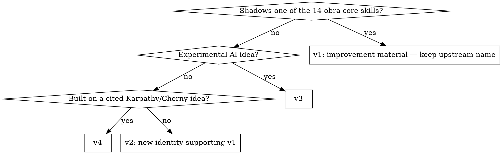

## Not this skill if
- The skill was authored from scratch inside the correct tier — run v2 `skill-lint` directly
- You are importing into v5 — v5 is verbatim-only; dispatch the `skill-porter` agent, no conversion allowed
- You are improving a v1 skill already in place — that is supercharging; follow `v1/SUPERCHARGING-OPTIONS.md`

# house-rules — convert any skill to this repo's house rules

## Purpose

Take a skill that was not written under this repo's tier rules and reshape it — tier placement,
frontmatter, body structure, bookkeeping — until it passes the house gates. Supports v1
**writing-skills**: that skill governs authoring content; this one governs landing foreign
content in the right tier with the right shape.

**Core rule:** a conversion is not done until v2 `skill-lint` and the `skill-auditor` agent both pass.

## Tier decision

Never convert *into* v5 — it is a verbatim holding area, not a target.

## House rules quick reference

| Tier | Required frontmatter | Body must have | Path |
|---|---|---|---|
| v1 | upstream shape (`name`, `description`) — keep upstream skill name | `## Supercharged vs upstream` section; start from verbatim upstream baseline | `v1/<name>/SKILL.md` |
| v2 | `name`, `description`, `tier: v2`, `supports:` (real v1 skills) | reference v1 content, never duplicate it | `v2/skills/<name>/SKILL.md` |
| v3 | `name`, `description`, `tier: v3`, `status: experimental` | creativity over polish — no v1/v2 bar | `v3/skills/<name>/SKILL.md` |
| v4 | `name`, `description`, `tier: v4`, `inspiration:` (originator + specific idea) | cite the Karpathy/Cherny idea it builds on | `v4/skills/<name>/SKILL.md` |

All tiers: kebab-case directory matching `name`; `description` starts with `Use when` and states
triggers only (never the workflow); a when-to-use or "Not this skill if" section; ≥2 numbered or
checkboxed steps; a proof/verification step; no placeholder text; cross-references resolve to
real tier paths. (These are v2 `skill-lint`'s seven checks — convert with the gate in mind.)

## Conversion procedure

1. Read the source skill in full. Note its slug, frontmatter shape, and every house-rule violation.
2. Choose the target tier with the flowchart above. A Forge skill shadowing an obra core (e.g.
   `debugging`, `testing`) is v1 improvement material — never a v2 promotion.
3. Rewrite the frontmatter to the target tier's shape (table above). Rewrite `description` to
   start with `Use when`, triggers only.
4. Restructure the body to the all-tier rules: triggers section, explicit steps, proof step.
   Strip Forge branding and renamed slugs; replace duplicated v1 content with references
   ("use v1 **X**").
5. Write the file at the tier path. If promoting from v5, delete the `v5/skills/<name>/` copy in
   the same change.
6. Update bookkeeping: add a row to the "Current skills" table in `v2/README.md` (v2), or update
   the tracker table in `v1/SUPERCHARGING-OPTIONS.md` (v1).
7. Verify: run the v2 `skill-lint` checklist on the converted file, then dispatch the
   `skill-auditor` agent. Fix every FAIL and re-run until both pass.

## Pitfalls

| Mistake | Fix |
|---|---|
| Promoting a core-shadowing Forge skill to v2 | It is v1 improvement material; v2 is new identities only |
| Inventing a new v1 skill identity | Only the 14 core obra skills live in v1 |
| Converting "into" v5 | v5 is import-only and verbatim; conversion always targets v1–v4 |
| Leaving the v5 copy after promotion | Promote-and-delete is one change, not two |
| Leaving Forge slugs in cross-references | Resolve each to this repo's tier path or drop it |
| Skipping the README/tracker row | Bookkeeping is part of the conversion, not a follow-up |

## Pairs with

- v1 **writing-skills** — governs authoring quality; house-rules governs placement and shape
- v2 `skill-lint` — the commit gate this conversion must pass (chains-to)
- `skill-auditor` agent (this repo) — final review before commit

PROVEN BY: a `skill-lint` PASS table for the converted file plus a clean `skill-auditor` report —
both are required before the conversion may be committed.
