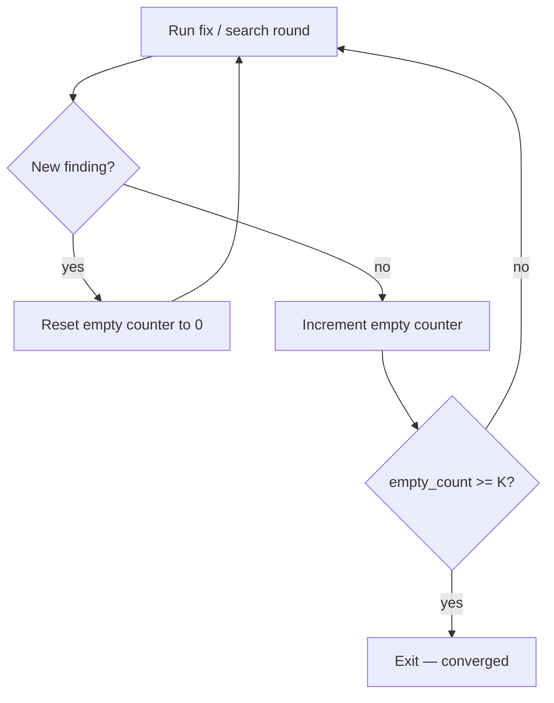

## Not this skill if

- A single deterministic fix is already known — just apply it and use v1 **verification-before-completion**.
- No objective green/empty signal exists — define one before starting (green suite, zero new findings, budget floor).

# Loop Until Green

## Purpose

Iterate until a convergence signal fires — not until patience runs out. Stopping at a fixed try count is the anti-pattern.

Supports v1 **test-driven-development** (the loop drives the suite back to green), v1 **verification-before-completion** (the exit condition is the evidence), and v1 **systematic-debugging** (escalation path when the loop can't converge).

## Triggers

**Use when:**
- "Fix until tests pass" / "keep going until green"
- Exhaustive bug or edge-case hunts where you do not know the count upfront
- Flaky-test chasing — the signal is a clean run, not N attempts

**Don't use when:**
- The fix is known and deterministic
- No measurable exit condition exists



## The pattern

### Three convergence modes

| Mode | Exit condition |
|---|---|
| **loop-until-green** | Full test suite passes (all assertions green) |
| **loop-until-dry** | N consecutive rounds produce zero new findings |
| **loop-until-budget** | Token budget drops below floor; emit partial results |

**Mode choice:** loop-until-GREEN exits on a single full-suite green pass (no counter needed). The K-consecutive-empty-rounds counter applies ONLY to loop-until-DRY — open-ended hunts where "nothing new" is the only stop signal.

### loop-until-dry counter

```
empty = 0; K = 3   # tune per task
while empty < K:
    findings = run_search_round()
    if findings: emit(findings); empty = 0   # reset on any new finding
    else: empty += 1
emit("converged after K empty rounds")
```

Exit only after K consecutive empty rounds — never on a round number. Dedupe each round's findings against **all** previously seen items — confirmed *and* rejected — so a finding already judged can't reappear and reset the counter.

## Pitfalls

| ❌ Anti-pattern | ✅ Correct |
|---|---|
| Stop at round 3 regardless of state | Exit only when the convergence signal fires |
| Forget to reset the empty counter on a new finding | Reset `empty = 0` every time a finding appears |
| Claim green without re-running the full suite | Re-run the complete suite on the final round; partial runs do not count |
| Treat a budget-floor exit as "green" | Report partial convergence; escalate via v1 **systematic-debugging** if incomplete |

## After

1. Invoke v1 **verification-before-completion** — re-run the full suite from a clean state.
2. Attach a **PROVEN BY:** block:
   - **loop-until-green:** paste passing run output (zero failures).
   - **loop-until-dry:** rounds run + "last K rounds zero findings" + K value.
   - **loop-until-budget:** budget consumed, findings emitted, exit reason = budget (not green).

Completion claims without `PROVEN BY:` are invalid under this skill.
