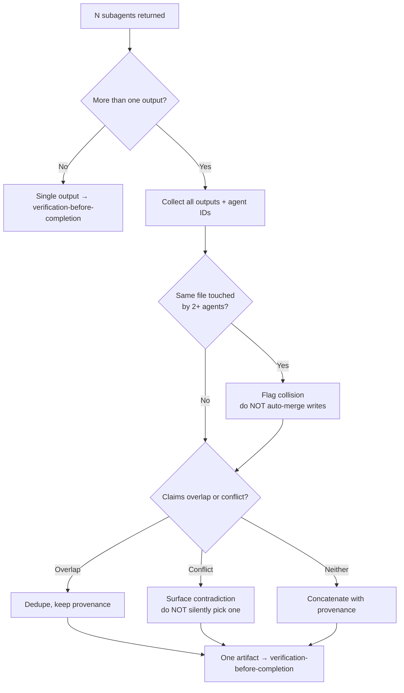

## Not this skill if

- **You want the whole map-then-reduce loop, not just the reduce** → use v5 `map-reduce-sweep`. This skill is the dedicated reduce/fan-in step it calls once agents return; it owns dedupe, contradiction detection, collision flagging, and provenance.
- **Agents are still running, or you are deciding whether to fan out** → that is v1 **dispatching-parallel-agents**; this skill is the fan-in step after it.
- **Only one agent ran** → no merge needed; just verify its output with v1 **verification-before-completion**.
- **Outputs conflict because tasks shared state** → you fanned out wrong; back up to v1 **dispatching-parallel-agents** and re-isolate with v1 **using-git-worktrees**, don't paper over it here.

# Merge Parallel Results

## Purpose

Fan-out without fan-in leaves you with N piles of output and no single answer. After concurrent subagents return, you must consolidate them into one artifact: dedupe overlapping findings, surface contradictions between agents, catch two agents that touched the same file, and tag every surviving claim with which agent produced it. The merge is where parallel work either becomes trustworthy or silently corrupts.

Supports v1 **dispatching-parallel-agents** by supplying the fan-in step that skill ends at, and v1 **verification-before-completion** by producing a single verifiable artifact.

**Core principle:** Never collapse N outputs into one without preserving provenance and surfacing every conflict — a merge that hides disagreement is worse than no merge.

## Triggers



**Use when:**
- 2+ subagents from v1 **dispatching-parallel-agents** have returned
- Their outputs overlap, may contradict, or may have touched shared files
- You need one consolidated artifact a human or next step can trust

**Don't use when:**
- Agents are still in flight (wait for the batch)
- Only one agent ran
- Outputs are already a single non-overlapping set

## The pattern

### 1. Collect with provenance attached

Pull every agent's output into one place and tag each chunk with its source agent **before** doing anything else. Provenance you don't capture now is provenance you can't reconstruct later.

```
results = [
  { agent: "A", task: "scan auth module",   findings: [...], files_touched: [...] },
  { agent: "B", task: "scan payment module", findings: [...], files_touched: [...] },
  ...
]
```

Every finding carries its `agent` tag from this point forward.

### 2. Detect file-overlap collisions

Intersect the `files_touched` sets across all agents. Any file claimed by 2+ agents is a collision — even if the tasks looked independent.

```
collisions = files where count(agents that touched it) > 1
```

A collision means the independence test from v1 **dispatching-parallel-agents** was wrong. **Do not auto-merge the writes.** Flag the file, list the colliding agents, and stop for a human decision or a re-run. Silent last-writer-wins is how parallel work loses data.

### 3. Detect contradictions

Compare claims that refer to the same subject. A contradiction is two agents asserting incompatible things about one thing ("config is loaded at boot" vs "config is loaded lazily").

- Group claims by subject/target.
- Within each group, flag any pair that cannot both be true.
- **Surface every contradiction with both sides and both agent tags.** Never silently pick a winner — that is the one thing this skill exists to prevent. If a tiebreak is needed, escalate, don't guess.

When a tiebreak is warranted, escalate it to a vote rather than a hunch: invoke v5 `parallel-judge-panel` over the contested claim. Merge the claim into the **Merged findings** region only if the panel reaches `consensus_threshold` (default `majority`); otherwise leave it in the **Contradictions** region with both sides and agent tags intact. The panel never silently overwrites — record the vote split as provenance so the resolution is as traceable as the disagreement.

### 4. Dedupe overlap (keep provenance)

Two agents reporting the *same* fact is overlap, not contradiction. Collapse duplicates into one entry, but keep the union of provenance.

```
finding: "rate limiter has no backoff"   sources: [agent C, agent E]
```

Multiple independent agents reaching the same finding raises confidence — record it, don't discard it.

### 5. Emit one artifact

Produce a single consolidated output with four clearly separated regions:

1. **Merged findings** — deduped, each with its source agent(s).
2. **Contradictions** — unresolved disagreements, both sides + agent tags.
3. **File collisions** — files touched by multiple agents, with the agent list.
4. **Provenance index** — claim → originating agent(s), so anything is traceable.

If contradictions or collisions remain, the artifact is **not** "done" — it is "ready for a decision." Say so explicitly.

## Common mistakes

❌ Concatenating outputs and calling it merged.
✅ Dedupe overlap and detect contradictions — a pile is not an artifact.

❌ Dropping agent tags once findings are combined.
✅ Carry provenance to the end; every surviving claim names its source.

❌ Silently picking one side when two agents disagree.
✅ Surface both sides with tags; escalate the tiebreak, never guess it.

❌ Auto-merging two agents' edits to the same file (last writer wins).
✅ Flag the collision, list the agents, and stop — that file was never independent.

❌ Treating multiple agents reporting the same fact as a conflict.
✅ That is overlap — collapse to one entry, union the provenance, raise confidence.

## Verification

The merge produces a completion claim ("N outputs consolidated into one artifact"). Prove it before chaining to v1 **verification-before-completion**.

PROVEN BY: a single artifact whose provenance index maps every surviving claim to its source agent, whose file-collision list is empty or explicitly flagged, and whose contradiction list is either empty or marked unresolved-and-escalated.
