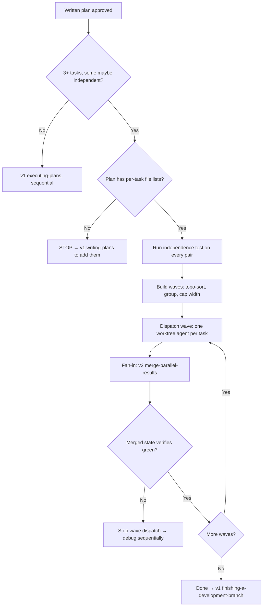

## Not this skill if

- **The plan has fewer than 3 tasks, or the tasks form a strict chain** → execute sequentially with v1 **executing-plans**; wave overhead buys nothing.
- **The tasks are research or exploration, not code changes** → v1 **dispatching-parallel-agents** directly; no worktrees, no waves.
- **Agents have already returned and you need the fan-in** → that is v2 **merge-parallel-results**; this skill ends where it begins.
- **There is no written plan yet** → v1 **writing-plans** first; this skill consumes a plan, it never invents one.

# Parallel Plan Executor

## Purpose

v1 has every piece — plans (**writing-plans**), execution (**executing-plans**), parallel dispatch (**dispatching-parallel-agents**), isolation (**using-git-worktrees**) — but no bridge: nothing decides *which plan tasks may safely run in parallel*, dispatches them isolated, and reassembles between waves. Done ad hoc, the failure mode is two agents editing the same file, and it is expensive.

Supports v1 **writing-plans** by requiring per-task file lists from plans, v1 **executing-plans** by replacing its sequential walk when independent waves exist, v1 **dispatching-parallel-agents** by supplying the partitioning that skill assumes you already did, and v1 **using-git-worktrees** by putting every wave agent in its own worktree.

**Core principle:** Two tasks share a wave only when their independence is *proven from the plan* — any uncertainty means sequence, never parallel.

## Triggers

## The independence test

Two tasks may share a wave only if **ALL four** conditions hold. Check every pair in the candidate wave.

1. **No file overlap** — the sets of files each task is expected to touch are disjoint. Derive the sets from the plan's per-task file lists. If the plan lacks them, **STOP** and return to v1 **writing-plans** to add them — never infer file sets by guessing; inference is how collisions happen.
2. **No ordering** — neither task consumes the other's output: types, function signatures, API responses, migrations, generated code.
3. **No shared mutable resource** — no common test database, port, fixture file, cache, or environment the tasks both write.
4. **Independently verifiable** — each task's verification command can run green without the other task's changes present.

Any condition uncertain → the pair is **not** independent. Sequence it.

## Wave construction

1. Topologically sort tasks by their dependency edges (condition 2 failures define the edges).
2. Within each topological level, group tasks that pass the full independence test pairwise into one wave.
3. Cap wave width at **3 agents** (default) — merge cost grows with width faster than the time saved.
4. Tasks that fit no wave run sequentially between waves, exactly as v1 **executing-plans** would.

## Dispatch protocol

For each task in the wave:

1. One agent, **worktree-isolated** (v1 **using-git-worktrees** lifecycle rules apply — creation, naming, cleanup).
2. The dispatch prompt must pass v2 **compile-goal-to-contract**'s completeness gate before sending.
3. The prompt carries exactly: the single task text, its file list **as a boundary** ("touch only these files"), the task's verification command, and the result format v2 **merge-parallel-results** expects (findings + `files_touched`).
4. Dispatch the whole wave in one message so agents run concurrently.

## Fan-in between waves

1. Wave returns → v2 **merge-parallel-results** for dedupe, contradiction detection, and file-collision flagging.
2. Run the full verification suite on the merged state — per-task green is not wave green.
3. Only a green merged state unlocks the next wave.
4. If merge finds a collision despite the test: record **which of the four conditions was judged wrong**, then re-sequence the remainder of the plan — the plan's independence claims are now suspect.

## Failure handling

One agent fails while others succeed: merge the successes, then run the failed task **sequentially in the main session**, where it gets v1 **systematic-debugging**. Never re-dispatch a failed task into the next wave blind — triage the failed return with v2 **dispatch-triage** first.

## Common mistakes

❌ Guessing file sets when the plan doesn't list them.
✅ STOP and return to v1 **writing-plans** — the file list is the load-bearing input.

❌ Treating per-task green as wave green.
✅ Verify the *merged* state before the next wave; integration is where parallel work breaks.

❌ Widening waves to "go faster."
✅ Cap at 3; merge cost grows with width faster than the speedup.

❌ Re-dispatching a failed task into the next wave.
✅ Failed tasks come home: sequential execution with v1 **systematic-debugging**.

❌ Parallelizing a plan that is really a chain.
✅ If the topological sort yields width-1 levels everywhere, this skill exits to v1 **executing-plans**.

## Verification

Each wave produces a completion claim ("wave N merged and green"). Prove it before dispatching wave N+1, and chain the final state to v1 **verification-before-completion**.

PROVEN BY: a wave log showing, for every wave — the pairwise independence verdicts, the dispatch prompts' file boundaries, the merge artifact from v2 merge-parallel-results with an empty (or explicitly handled) collision list, and the green full-suite run on the merged state.
