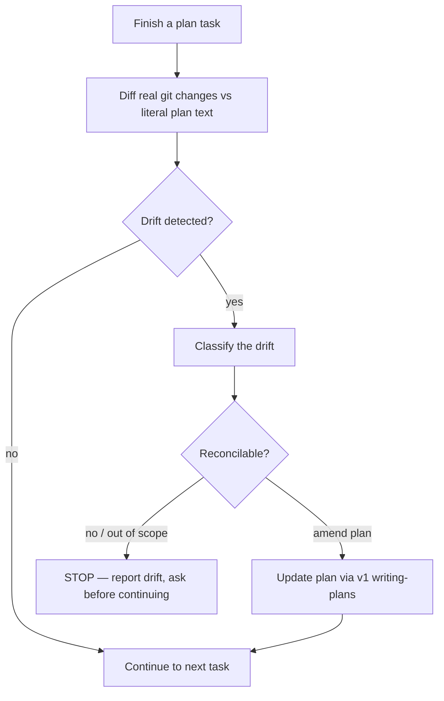

## Not this skill if

- You are at the "done" boundary checking the full completion battery — that is v2 **done-gate** (it watches *completion*, this watches *divergence mid-flight*).
- You made a decision on an unverified belief — register it with v2 **track-assumption** (it watches *assumptions*, this watches *plan ↔ reality*).
- There is no written plan to drift from — drift is measured against a plan; without one there is nothing to reconcile.

# Plan Drift Detector

## Purpose

A written plan is the source of truth only while reality tracks it. v1 **executing-plans** says "follow each step exactly," but real execution discovers missing files, dead steps, and adjacent work the plan never anticipated. Left unchecked, the diff and the plan quietly desync — and the plan stops describing what was actually built.

This skill makes divergence a **detected event**, not a silent slide. At each task boundary it compares the real `git diff` against the literal plan text. Any drift forces a reconcile: amend the plan via v1 **writing-plans**, or stop. The plan stays the source of truth instead of becoming fiction.

**Boundary (new lane):** v2 **done-gate** checks *completion* at the end of work; v2 **track-assumption** watches *unverified beliefs*; this skill watches *plan ↔ reality divergence DURING execution*. It does not restate either — it fires between tasks while v1 **executing-plans** runs.

## Triggers

**Use when:**
- Executing a written plan and the diff has touched a file the plan never named
- A plan step turned out unnecessary, impossible, or already done — and you skipped or reordered it
- "While I was in there I also fixed..." — scope is creeping past the current task
- The plan said Task N modifies X but the work also rewired Y

**Don't use when:**
- No written plan exists — there is no truth to drift from
- You are at the final "done" gate (v2 **done-gate**) rather than mid-execution
- The deviation is a decision on an unverified fact (v2 **track-assumption**)

## The pattern

### Detect — compare diff to the literal plan, not your memory

After each task in v1 **executing-plans**, re-read the task's literal **Files:** block and steps from the plan file, then read the actual `git diff`. Match three signals:

| Drift type | Signal | Where it shows |
|---|---|---|
| **Untracked file** | A file in the diff that no task's **Files:** block names | `git diff --name-only` vs plan **Files:** lines |
| **Skipped / reordered step** | A planned step with no corresponding change, or done out of sequence | Plan step list vs diff + commit order |
| **Scope creep** | Changes beyond what this task's steps describe | Diff hunks with no matching plan step |

### Classify and reconcile — every drift gets resolved, none ignored

| Classification | Reconcile action |
|---|---|
| **Plan was wrong** (file needed but unlisted, step impossible) | Amend the plan via v1 **writing-plans**; re-lint; then continue |
| **Plan was right, work wandered** (scope creep) | Revert the extra change OR split it into its own planned task — do not smuggle it in |
| **Step genuinely obsolete** (already done, dependency dropped) | Mark it resolved in the plan with a one-line reason; do not delete silently |
| **Cannot reconcile** (drift implies a different approach) | STOP — report drift with evidence, return to v1 **writing-plans** for an amendment before continuing |

The rule: no task closes with unreconciled drift. Either the plan is updated to match reality, or reality is reverted to match the plan, or you stop.

## Pitfalls

| ❌ Anti-pattern | ✅ Correct |
|---|---|
| Compare diff against your memory of the plan | Re-read the literal plan file each boundary — memory drifts too |
| "I'll update the plan at the end" | Reconcile at the task boundary; a stale plan misroutes the next task |
| Fold scope creep into the current task silently | Revert it or split it into its own planned task |
| Delete an obsolete step with no trace | Mark it resolved in the plan with a one-line reason |
| Treat any deviation as a stop | Reconcilable drift amends the plan and continues; only un-reconcilable drift stops |
| Run this only once at the end | It is a per-task-boundary check, between v1 **executing-plans** tasks |

## After

1. Hand the reconciled plan back to v1 **executing-plans** for the next task — the plan now matches the diff produced so far.
2. If the plan was amended, the amendment goes through v1 **writing-plans** (re-lint) so the source of truth stays clean.
3. Attach a **DRIFT CHECK:** line per task boundary: `clean` (diff matches plan) OR `reconciled — <plan amended | change reverted | step marked obsolete>` OR `stopped — <reason>`. A task that closes without a DRIFT CHECK line is invalid under this skill.
