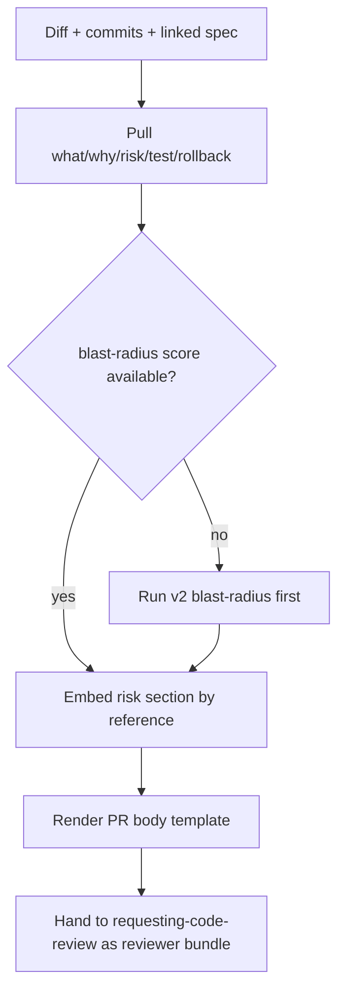

## Not this skill if

- The audience is users reading a changelog or GitHub Release — that is v2 **write-release-notes** (user-facing, grouped by Feature/Fix/Internal). This skill writes the REVIEWER-facing PR body: different audience, different content.
- You are deciding *how* to land the branch (merge vs PR vs keep) — that is v1 **finishing-a-development-branch**. This skill fills the `--body` of the PR that step creates; it does not choose the exit.
- The change is a one-line trivial diff a reviewer reads faster than any prose — a one-sentence summary beats a five-section template.

# PR Description Synthesizer

## Purpose

A reviewer's first cost is reconstructing intent from a raw diff. A PR body that just restates commit subjects forces them to do that work anyway. This skill synthesizes a reviewer-facing artifact — what changed, why, blast radius, test evidence, rollback — pulled from sources already in context, so the reviewer spends their attention on the *risky* parts, not on orientation.

Supports v1 **requesting-code-review** (the synthesized body is the bundle the reviewer reads first) and v1 **finishing-a-development-branch** (it fills the `## Summary` / `## Test Plan` body of the PR created in that step's Option 2). It does NOT restate v2 **blast-radius** or v2 **evidence-trail** — it embeds their outputs by reference.

## Triggers

**Use when:**
- Opening a PR via v1 **finishing-a-development-branch** Option 2 — synthesize the `--body` instead of writing two bullets by hand
- Preparing v1 **requesting-code-review** — the body becomes the reviewer's orientation
- Updating a PR after new commits — re-synthesize so the body tracks the diff, not the original intent

**Don't use when:**
- The diff is trivially self-explanatory (one line, one obvious reason)
- The audience is users, not reviewers — use v2 **write-release-notes**



## The pattern

### The PR-body template (five reviewer-facing sections)

| Section | Answers the reviewer's question |
|---|---|
| **What changed** | "What am I looking at?" — 2-4 bullets of behavior change, not file lists |
| **Why** | "Should this exist?" — the intent, traced to the spec/issue |
| **Risk & blast radius** | "Where do I look hardest?" — the v2 **blast-radius** level + the most-impacted symbols |
| **Test evidence** | "How do I know it works?" — the verification proof, by reference |
| **Rollback** | "How do I undo this if it breaks?" — revert SHA, feature flag, or migration-down step |

### What to pull from where

| Section | Primary source | Rule |
|---|---|---|
| What changed | `git diff <base>..HEAD` | Describe behavior, not the diff verbatim — the diff is already attached |
| Why | linked spec / plan / issue | Pull intent from the spec, not from a commit subject |
| Risk & blast radius | v2 **blast-radius** output | Embed the LOW/MED/HIGH/CRITICAL level + top symbols; do not re-derive the trace |
| Test evidence | v2 **evidence-trail** log / v1 **verification-before-completion** block | Reference the proof (command + result); do not paste a wall of log |
| Rollback | commits + deploy/migration knowledge | State the concrete undo, not "git revert" as a platitude |

### Output shape

```markdown
## Summary
- <behavior change 1>
- <behavior change 2>

**Why:** <intent, traced to spec/issue #234>

**Risk:** HIGH (blast-radius) — 21 direct dependents on `parseConfig`; review the cache path hardest.

## Test Plan
- [x] <verification — command + result, by reference to evidence-trail>

**Rollback:** revert <SHA>; migration-down `0042_add_index`; flag `new_parser` defaults off.
```

This is the `## Summary` / `## Test Plan` body the v1 **finishing-a-development-branch** Option 2 PR template expects — synthesized, not hand-typed.

## Pitfalls

| ❌ Anti-pattern | ✅ Correct |
|---|---|
| Paste commit subjects as the body | Rewrite as behavior + intent; the commits are a source, not the output |
| Restate the v2 **blast-radius** trace inline | Embed the level + top symbols by reference; the trace lives in blast-radius |
| Paste the full test log into Test Plan | Reference the v2 **evidence-trail** / verification proof (command + result) |
| Write user-facing changelog prose | Write reviewer-facing prose — that is v2 **write-release-notes**'s job, not this one |
| Skip the Rollback section | Always state the concrete undo; "it breaks, then what?" is a review question |
| Let the body drift from the diff after new commits | Re-synthesize on update so What/Risk track the current diff |

## After

1. Hand the synthesized body to v1 **requesting-code-review** as the reviewer's orientation bundle, or to v1 **finishing-a-development-branch** Option 2 as the PR `--body`.
2. Confirm each section traces to a real source — diff, commit, spec, v2 **blast-radius**, v2 **evidence-trail** — with no fabricated risk or test claim.

PROVEN BY: a five-section body where Risk cites a blast-radius level and Test Plan references real verification evidence. A body that is a verbatim dump of commit subjects, or restates the blast-radius trace inline, is invalid under this skill.
