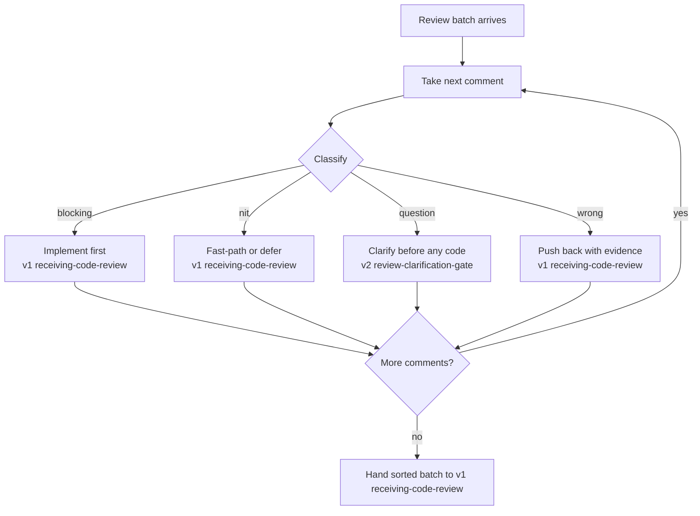

## Not this skill if

- A single comment arrived in isolation — just engage it directly via v1 **receiving-code-review**; there is nothing to sort.
- Every comment is already understood and sound — skip the rubric and implement via v1 **receiving-code-review**.
- The disagreement is about the spec, not the code — challenge the spec with v2 **red-team-spec** before any review triage.

# Review Feedback Triage

## Purpose

v1 **receiving-code-review** is the discipline for engaging each comment rigorously — verify before implementing, ask before assuming, push back with evidence. But it engages comments one at a time and assumes you already know which comments demand which engagement. This skill is the up-front sorting pass that runs *before* that engagement: take the whole batch, give every comment exactly one class, and route each class to the right v1 move.

The failure this prevents is the all-or-nothing reflex — treating every comment as a command (blind compliance) or every comment as an attack (blanket defensiveness). Triage forces a per-comment decision, so a blocking bug and a naming nit never get the same reaction.

Two narrower skills handle single branches; this one owns the whole sort on the receiving side. v2 **review-clarification-gate** handles only the *question* branch in depth (it manufactures the missing clarity). v2 **reviewer-lenses** *generates* reviews on the requesting side. This skill is the receiving-side triage across all four branches and routes into both of them.

## Triggers

**Use when:**
- A review lands with multiple comments and you are deciding what to do first
- You feel the urge to either implement everything or argue everything
- Comments mix real defects with style preferences and open questions

**Don't use when:**
- Only one comment exists, or all comments are already classified and sound

## The pattern

### Classification rubric

Give every comment exactly one class. When two could fit, pick the higher-stakes one (blocking > question > wrong > nit) so nothing important gets sorted as a nit.

| Class | Test that puts a comment here | Telltale signal |
|---|---|---|
| **blocking** | If unaddressed, the change is incorrect, unsafe, or breaks something — behavior, security, data, or a contract is at stake | "this crashes when…", "this leaks…", "this drops the error", a failing case the reviewer named |
| **nit** | A preference with no behavior impact — style, naming, wording, ordering | "prefer", "minor", "could be cleaner", formatting |
| **question** | You cannot act because meaning or motivation is unclear, or the reviewer is asking, not asserting | "why does this…?", "is this intentional?", anything readable two ways |
| **wrong** | You understand it fully and have evidence the reviewer is mistaken about this codebase | contradicts a test, a grep result, a platform constraint, or a prior decision |

A comment is **wrong** only if you can already state the reviewer's intent *and* have the contradicting evidence. If you cannot state their intent, it is a **question**, not wrong — that distinction is what stops reflexive defensiveness.

### Routing table

| Class | Route to | First move | Order |
|---|---|---|---|
| **blocking** | v1 **receiving-code-review** | Implement with its verifying-test artifact | Do first |
| **nit** | v1 **receiving-code-review** | Fast-path if mechanical and behavior-free; otherwise batch or defer | Do last |
| **question** | v2 **review-clarification-gate** | Send a clarification request; freeze related code until answered | Before any code on related items |
| **wrong** | v1 **receiving-code-review** | Push back with the contradicting command + output | After clarifications resolve |

One open **question** can re-class its neighbors — get the answer before locking in the rest of the sort.

## Pitfalls

| ❌ Anti-pattern | ✅ Correct |
|---|---|
| Implement every comment because it came from a reviewer | Sort first; only **blocking** and reviewed **nit** comments are implement-now |
| Argue every comment to look rigorous | Only **wrong** comments get push-back, and only with evidence in hand |
| Mark a comment **wrong** because you'd rather not ask | If you can't state the reviewer's intent, it's a **question** — route to v2 **review-clarification-gate** |
| Restate v1's implement/clarify/push-back gate here | This skill only sorts and routes; the engagement discipline stays in v1 **receiving-code-review** |
| Fix the easy nits first because they feel productive | **Blocking** items lead; nits are last so they never crowd out a real defect |
| Leave a comment unclassified ("I'll get to it") | Every comment gets exactly one class — an unsorted comment is an untracked risk |

## After

1. Confirm the sort is total: every comment has exactly one class, no comment is unclassified.
2. Route per the table — questions through v2 **review-clarification-gate** first, then hand the batch to v1 **receiving-code-review** for engagement of blocking, nit, and wrong items.
3. Attach a **PROVEN BY:** block: the classification table with every comment assigned a class and a route. A review batch engaged without a complete sort is invalid under this skill — that is exactly the blind-compliance / blanket-defensiveness failure this skill exists to prevent.
