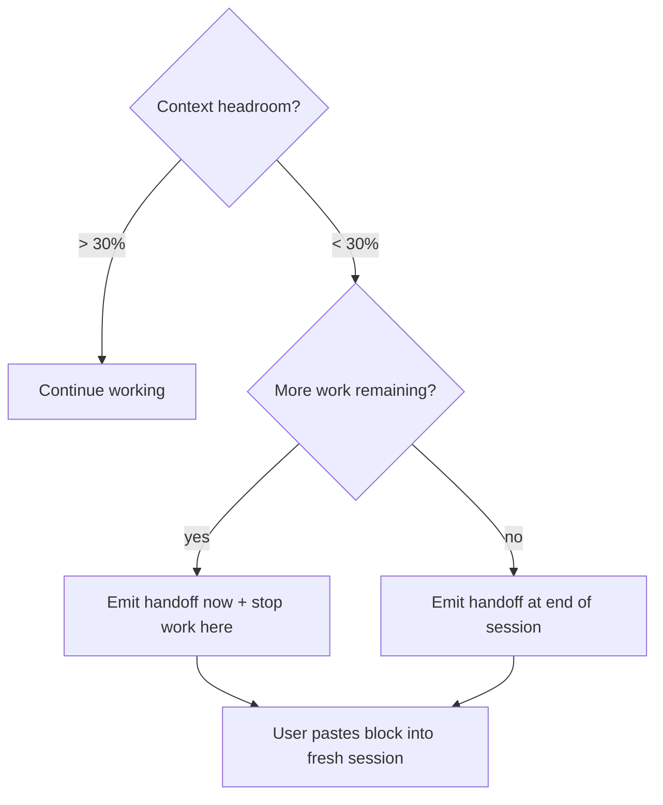

## Not this skill if
- You are handing off work to a *different agent* — use v5 `agent-handoff` instead
- Context is still healthy (> 30% headroom) — finish the current task first
- The user wants a summary for documentation, not for session resumption

# session-handoff — resumable state for the same user in a fresh session

## Purpose

Long sessions exhaust context. When that happens, the user loses continuity: a new session starts cold with no memory of decisions made, files being edited, or what comes next. This skill packages the session state into a paste-ready block so the fresh session picks up exactly where this one left off.

Supports v1 **executing-plans** (a multi-session plan execution survives the session boundary) and v1 **writing-plans** (the handoff block carries the plan state forward instead of forcing a re-plan).

**This is not agent-to-agent.** The same human user opens a new Claude Code session and pastes the block at the top. The block is self-contained: no conversation history is needed.

## When to use



## Output format

Emit the following fenced block as the final output of the session. The user copies it verbatim.

````
```session-resume
## Session handoff — paste this at the top of your next session

### Goal
[One sentence: what the user is trying to accomplish overall]

### Open files (being actively edited)
- `path/to/file.ts` — [what is in progress: e.g. "halfway through adding retry logic in `processQueue()`"]
- `path/to/test.ts` — [state: e.g. "test written, not yet passing"]

### Pending tasks
[Copy the active task list as bullet points, with a checkbox marker:]
- [ ] Task still to do
- [ ] Another remaining task
- [x] Already done (include for context — the next session can see what's complete)

### Key decisions made this session
[Numbered list — each decision must be actionable, not just descriptive:]
1. Chose Redis over Postgres for session storage — latency must be < 1ms
2. Out of scope: auth.controller.ts is under legal freeze — do not modify
3. Test framework: Vitest (not Jest) — already configured in vitest.config.ts

### Blocking questions
[List only genuine blockers — questions that must be answered before work can continue:]
- [Leave empty if none]

### Next concrete action
[Single sentence — the exact first thing the fresh session should do:]
"Run `npm test` to see current test failures, then fix the `processQueue` mock in `queue.test.ts`."

### State snapshot
- Branch: `feat/queue-retry`
- Last commit: `abc1234 — add retry logic skeleton`
- Tests: 14 passing, 3 failing (listed in pending tasks)
- Files modified this session: auth.service.ts, queue.service.ts, queue.test.ts
```
````

All fields are required. Write `none` for any field with nothing to say. Do not omit fields — an omitted field forces the fresh session to re-derive information.

## Process

1. Read the current task list (from TodoRead or conversation history)
2. Identify files with active, incomplete edits
3. Extract key decisions from the conversation — look for explicit choices, constraints, and scope decisions
4. Identify any blocking questions that need answers before work can resume
5. State the single next concrete action in one imperative sentence
6. Capture branch, last commit SHA, and test status
7. Emit the fenced block above
8. Tell the user: "Context handoff ready. Open a new session and paste the block at the top."

## Quality checks

Before emitting, verify each section:

| Section | Check |
|---------|-------|
| Open files | Every file listed has genuinely incomplete work in this session |
| Pending tasks | Matches the actual task list — no invented tasks |
| Key decisions | Each decision is concrete enough to act on (not "we discussed Redis") |
| Blocking questions | Only real blockers — not hedges or hypotheticals |
| Next concrete action | Single sentence, imperative, specific enough to execute without context |
| State snapshot | Branch and commit SHA verified against `git status` / `git log -1` |

## Common mistakes

| Mistake | Fix |
|---------|-----|
| Emitting a summary instead of a resume block | The block must be paste-ready — no prose outside the fenced block |
| Listing decisions as "we discussed X" | Write the *outcome*: "Decided X because Y" |
| Omitting files that have unsaved or uncommitted work | Always include files with work in progress |
| Writing multiple next actions | One sentence only — the fresh session must start somewhere specific |
| Skipping the state snapshot | Without branch + commit, the fresh session may work on the wrong base |

## Integration

- v1 **executing-plans** — when a plan outlives the session, the handoff block is how the next session resumes mid-plan
- v5 `agent-handoff` — the agent-to-agent equivalent; different format, different recipient
