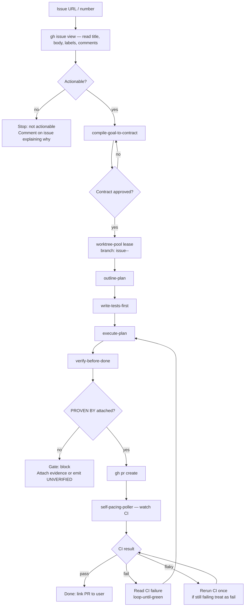

## Not this skill if
- The issue is too vague to action without design work — use `scope-feature` first, then return here
- You want to run multiple issues in parallel — invoke this skill once per issue inside `run-agents-in-parallel`
- The issue is a question or discussion, not an actionable task
- You have no `gh` CLI access or the repo is not cloned locally

# autonomous-issue-runner — handle a GitHub issue end-to-end

## Purpose

Take a GitHub issue from open to merged PR without manual skill-hopping. The runner reads the issue, contracts what done means, opens an isolated worktree, implements, verifies, opens a PR, and watches CI. It stops only when a gate fires or a real decision is needed.

This is the outermost automation loop for issue-driven development.

## Prerequisites

```
[ ] gh CLI authenticated: gh auth status
[ ] Repo cloned and worktree-pool initialised (worktree-pool skill)
[ ] agent-harness verified (agent-harness skill)
[ ] compile-goal-to-contract and proof-gate wired
[ ] fetch-open-issues available if running in batch mode (fetches the issue queue)
```

Halt and run prerequisites if any are missing.

## Flow



## Steps

### 1. Read the issue

```bash
gh issue view <number> --json title,body,labels,comments,assignees
```

Extract: what is broken or missing, any reproduction steps, any linked PRs or related issues. If the body is empty or the title is ambiguous, comment on the issue asking for clarification and stop — do not invent requirements.

### 2. Contract the goal

Invoke `compile-goal-to-contract` with the issue content. The contract must include:
- Acceptance criteria derived from the issue description
- `done-when` items that map to runnable checks in this codebase
- Out-of-scope: anything in adjacent issues, anything requiring a design decision not in the issue

Get user approval before proceeding. If the issue is trivial (one-line typo fix, one-line config change) a minimal contract is fine — do not over-engineer.

### 3. Open a worktree

```bash
# via worktree-pool
wtpool lease issue-<number>-<slug>
```

Branch name: `issue-<number>-<3-word-slug-from-title>`. Work exclusively in this worktree. Never touch files outside it.

### 4. Implement

Run `outline-plan` → `write-tests-first` → `execute-plan` inside the worktree. Tests written in step write-tests-first must be failing before implementation and passing after.

### 5. Verify

Run `verify-before-done`. Attach `PROVEN BY:` to every done claim. The `done-when` items from the contract are the evidence targets.

### 6. Open the PR

```bash
gh pr create \
  --title "<issue title>" \
  --body "Closes #<number>\n\n<one-paragraph summary of approach>\n\nPROVEN BY: <evidence lines>" \
  --base main \
  --head issue-<number>-<slug>
```

Link the issue in the PR body with `Closes #<number>`. The PR description must include the PROVEN BY evidence.

### 7. Monitor CI

Invoke `self-pacing-poller` to watch CI status. On failure:
- Read the failure log
- Invoke `loop-until-green` to fix
- Re-verify before re-pushing

On persistent flakiness (same failure after two reruns): comment on the PR with the failure details and stop — do not loop indefinitely.

### 8. Done

When CI passes, report the PR URL to the user. Release the worktree:

```bash
wtpool release issue-<number>-<slug>
```

Do not merge the PR autonomously unless the user explicitly said to.

## Gate behaviour

| Gate | Action |
|------|--------|
| Issue not actionable | Comment on issue explaining, stop |
| Contract not approved | Revise contract, do not proceed |
| PROVEN BY missing | Block completion, attach evidence |
| CI fails after two fix attempts | Comment on PR, stop, surface to user |
| Unexpected files touched | Stop, report to user, do not commit |

## Related skills

- `compile-goal-to-contract` — step 2; required
- `worktree-pool` — step 3; required
- `agent-harness` — prerequisite setup
- `loop-until-green` — CI fix loop in step 7
- `self-pacing-poller` — CI monitoring in step 7
- `proof-gate` — enforces PROVEN BY at step 5
- `run-agents-in-parallel` — run multiple instances of this skill concurrently
