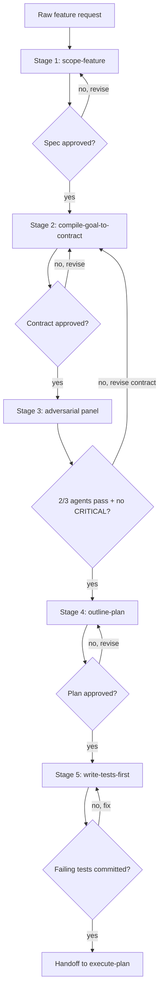

## Not this skill if
- The feature is already scoped and contracted — go straight to `outline-plan`
- You need a one-off quick task done without formal intake — invoke the individual skills
- The request needs design exploration before scope — use `scope-feature` standalone first, then return here

# feature-intake-pipeline — autonomous intake flow from raw request to ready-to-build plan

## Purpose

A raw feature request is the messiest starting point in the development loop. The intent is vague, the scope is undefined, the acceptance criteria do not exist yet, and the tests cannot be written until all three are resolved.

This skill automates the intake: it runs the four pre-implementation skills in sequence, enforcing gates between each stage, and hands off a ready-to-build plan to `execute-plan`. The human reviews at gates; the pipeline handles the mechanics.

## Core rule

> **Rule:** Each stage produces a gate artefact. The next stage does not start until the gate artefact is approved. A skipped gate means a skipped stage — the pipeline stops, not skips.

## Invocation modes

| Mode | Flag | Gate behaviour |
|------|------|---------------|
| Interactive | `--interactive` (default) | Pause at every gate; wait for `approve / revise / abort` |
| Semi-auto | `--semi-auto` | Auto-approve gates where confidence ≥ 0.9; pause otherwise |
| Full-auto | `--full-auto` | Run end-to-end; log all decisions; interrupt only on hard failures |

Invoke with mode:
```
/feature-intake-pipeline "add OAuth login" --semi-auto
```

## Resuming a pipeline

If a pipeline was interrupted (context reset, abort, gate failure), resume it:
```
/feature-intake-pipeline --resume 2026-05-30-oauth-login
```

The skill passes the run ID to `Workflow({ resumeFromRunId })`. Completed stages return cached results instantly. Already-approved gates are not re-presented.

## Pipeline stages



## Stage 1 — scope-feature

Invoke `scope-feature` with the raw request.

Gate artefact: spec table covering purpose, constraints, success criteria, non-goals, chosen approach, open questions.

Gate condition: user explicitly approves the spec. "Looks fine" is approval. No response after 2 prompts → stop and wait, do not proceed.

Write the spec to `docs/plans/YYYY-MM-DD-<feature>-spec.md` and commit before moving to stage 2.

## Stage 2 — compile-goal-to-contract

Invoke `compile-goal-to-contract` with the approved spec.

The contract must be derived from the spec — do not re-ask questions already resolved in stage 1. Map spec success criteria directly to contract acceptance criteria. Map spec non-goals directly to contract out-of-scope.

Gate artefact: contract block with acceptance-criteria, out-of-scope, done-when, constraints, open-decisions.

Gate condition: all open-decisions resolved (user answered or bounded by a decision rule). Contract approved by user.

Write relay variables:
```relay-set
key: compile-goal-to-contract.acceptance-criteria
type: string[]
value: [<from contract>]
```
```relay-set
key: compile-goal-to-contract.done-when
type: string[]
value: [<from contract>]
```

## Stage 3 — outline-plan

Invoke `outline-plan` with the approved spec and contract.

The plan must reference the contract's done-when items — each plan task should map to one or more acceptance criteria. A task with no acceptance criterion is scope creep; remove it.

Gate artefact: plan file at `docs/plans/YYYY-MM-DD-<feature>.md` with tasks, file paths, commands, and `DONE WHEN:` clause per task.

Gate condition: task count 5–15 (hard max 20). Every task has a file path and a `DONE WHEN:`. User approves.

Write relay variable:
```relay-set
key: outline-plan.plan-path
type: string
value: docs/plans/YYYY-MM-DD-<feature>.md
```

## Stage 4 — write-tests-first

Invoke `write-tests-first` for each task in the plan that involves new or modified behaviour.

Tests must be failing before any implementation. Commit the failing tests as a baseline:

```bash
git add <test files>
git commit -m "test: add failing tests for <feature> (pre-implementation)"
```

Gate artefact: committed failing test suite. `git log --oneline -1` shows the test commit.

Gate condition:
```
PROVEN BY: pytest / npm test / cargo test → <N> failed, 0 passed (expected: all failing)
```

If any test passes before implementation, the test is testing existing behaviour — it is not a new test. Remove or rewrite it.

## Handoff to execute-plan

Once all four gates pass, emit the handoff:

````
```handoff
task: implement <feature name> per approved plan
goal-contract: docs/plans/YYYY-MM-DD-<feature>-spec.md
state:
  branch: <current branch>
  worktree: <path if applicable>
  last-commit: <sha of failing test commit>
  files-changed: <test files only at this point>
  tests-passing: partial — 0/<N> (all failing, expected)
context:
  decisions: |
    <key decisions from stages 1–3>
  blockers: none
  open-questions: none
evidence:
  PROVEN BY: git log → test commit <sha>
  PROVEN BY: pytest → <N> failed, 0 passed
next-agent: execute-plan
```
````

Then invoke `execute-plan` with the plan path.

## Gate failure handling

| Gate fails | Action |
|-----------|--------|
| Spec not approved | Return to `scope-feature`, address specific objections |
| Contract open-decisions unresolved | Ask user to decide; do not bound autonomously unless given explicit permission |
| Plan task count > 20 | Decompose into two plans; handle first plan through pipeline, queue second |
| Tests pass before implementation | Tests are testing existing code — write new tests or confirm the feature already exists |

## Pipeline state log

Append one line per gate to `docs/plans/YYYY-MM-DD-<feature>-intake.log`:

```
[YYYY-MM-DD HH:MM] stage-1 spec approved — docs/plans/YYYY-MM-DD-<feature>-spec.md
[YYYY-MM-DD HH:MM] stage-2 contract approved — 4 criteria, 2 out-of-scope, 3 done-when
[YYYY-MM-DD HH:MM] stage-3 plan approved — 8 tasks, critical path: 4 tasks
[YYYY-MM-DD HH:MM] stage-4 tests committed — sha <abc123>, 8 failing
```

This log is the `PROVEN BY:` artefact for the intake pipeline itself.

## Related skills

- `scope-feature` — stage 1
- `compile-goal-to-contract` — stage 2
- `red-team-spec`, `challenge-spec` — inform the adversarial panel prompts (Stage 3)
- `outline-plan` — stage 3
- `write-tests-first` — stage 4
- `execute-plan` — downstream; receives the handoff from this pipeline
- `agent-handoff` — the handoff bundle format used at the end of stage 4
- `context-variable-relay` — relay variables written at stages 2 and 3
- `orchestrate-feature` — the full autonomous loop; this skill handles only the intake portion
