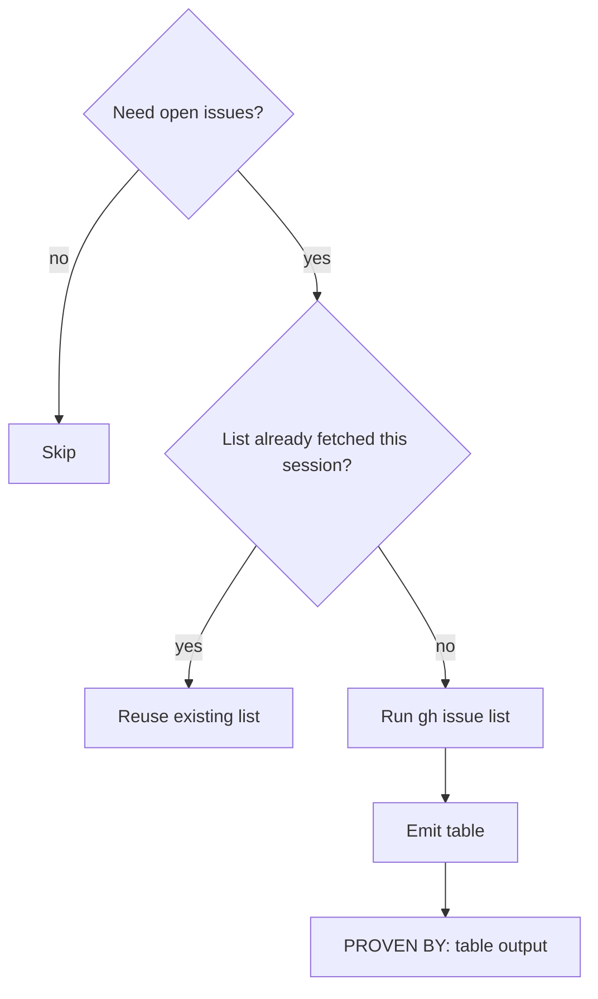

## Not this skill if
- You need to read one issue's full body — run `gh issue view <number>` directly
- The repo is not on GitHub or the `gh` CLI is not authenticated
- You already have the issue list — don't re-fetch

# fetch-open-issues — get a structured issue list from GitHub

## Purpose

Pull open issues from a GitHub repo into a structured table so downstream skills
(`autonomous-issue-runner`, `compile-goal-to-contract`) have a concrete intake
queue rather than working from memory or a vague "look at the issues."

## Core rule

> **Rule:** Fetch once per session. If the list was fetched earlier in the same
> session, reuse it. Re-fetching mid-session creates a moving target.

## Trigger



## Process

1. Confirm `gh` is authenticated: `gh auth status`
2. Determine target repo: default is the current directory's `origin` remote; override with `--repo owner/name` if needed
3. Run the fetch command (see below)
4. Emit the result as a markdown table
5. Note the fetch timestamp so downstream steps can cite it

## Command

```bash
gh issue list \
  --state open \
  --json number,title,labels,assignees,url \
  --limit 50
```

Default `--limit 50` covers most active repos. Raise to `--limit 200` if the
repo has high issue volume. The GitHub API caps at 1000 regardless of `--limit`.

Optional filters — add any combination:

| Flag | Purpose | Example |
|------|---------|---------|
| `--label <label>` | Limit to labelled issues | `--label bug` |
| `--assignee <user>` | Limit to one assignee | `--assignee @me` |
| `--milestone <title>` | Limit to a milestone | `--milestone v2` |
| `--repo <owner/name>` | Explicit repo | `--repo org/repo` |
| `--limit <n>` | Cap result count | `--limit 20` |

## Output format

Emit as a markdown table. Required columns: number, title, labels, assignee, URL.

| # | Title | Labels | Assignee | URL |
|---|-------|--------|----------|-----|
| 42 | Fix login timeout | `bug`, `priority:high` | @alice | https://github.com/… |
| 37 | Add dark mode | `enhancement` | — | https://github.com/… |

If the repo has no open issues: emit "No open issues found in `<owner/repo>`."

## Passing the list downstream

When handing off to `autonomous-issue-runner`:
- Include the full table
- Include the filter flags used (so the runner knows the scope)
- Include the fetch timestamp

When handing off to `compile-goal-to-contract`:
- Pass the single issue row being contracted, not the full table

## Pitfalls

| Mistake | Fix |
|---------|-----|
| Forgetting the 1000-result GitHub API cap | If the repo has more than 1000 open issues, `gh issue list` silently truncates. Filter by label or milestone to stay under the cap. |
| Re-fetching mid-session | The list becomes a moving target if fetched twice in one session. Check the trigger diagram — if the list was already fetched, reuse it. |
| Passing the full table to `compile-goal-to-contract` | That skill expects a single issue row, not the full table. See "Passing the list downstream." |

## PROVEN BY

The emitted markdown table (or "No open issues" line), showing the repo name,
the filter flags applied, and the fetch timestamp.

Example:

```
PROVEN BY: gh issue list --state open --limit 50 on org/repo at 2026-05-30T11:45Z
Returned 12 issues. Table above.
```
