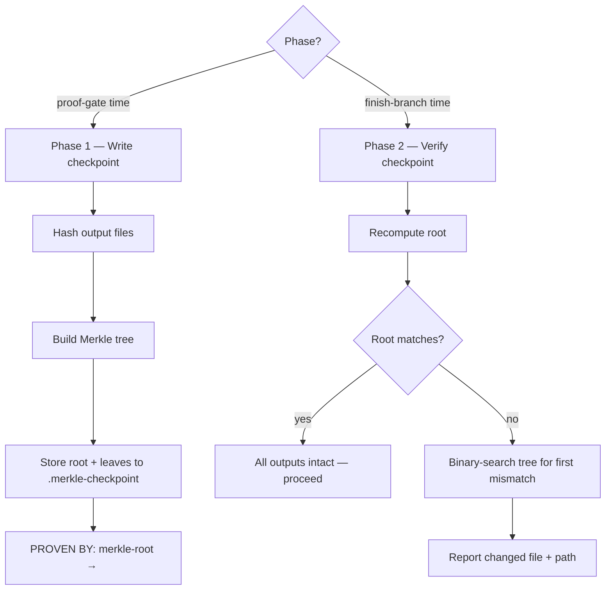

## Not this skill if
- You have no output files to verify (no artifacts produced this turn)
- The task has not yet reached a completion checkpoint — wait until `proof-gate` fires
- You only need to verify a single file — `sha256sum <file>` is sufficient

# merkle-proof-checkpoint — physical verification of PROVEN BY claims

## Purpose

A `PROVEN BY:` tag is a text claim. This skill makes it physically verifiable: at proof-gate time it hashes every output file and stores a Merkle root; at finish-branch time it recomputes the root and, if they differ, binary-searches the tree to locate the changed file in at most ⌈log₂(n)⌉ comparisons instead of re-hashing all n files.

## Two-phase structure



## Phase 1 — Write checkpoint

Run at proof-gate time, after all output files are written.

```bash
#!/usr/bin/env python3
# merkle-checkpoint-write.py
import hashlib, json, os, sys
from pathlib import Path

def sha256(path):
    h = hashlib.sha256()
    with open(path, "rb") as f:
        for chunk in iter(lambda: f.read(65536), b""):
            h.update(chunk)
    return h.hexdigest()

def build_merkle(leaves):
    """Build a Merkle tree bottom-up. Returns (root_hash, tree_levels)."""
    if not leaves:
        return hashlib.sha256(b"").hexdigest(), []
    level = list(leaves)
    tree = [list(level)]
    while len(level) > 1:
        next_level = []
        for i in range(0, len(level), 2):
            left = level[i]
            right = level[i + 1] if i + 1 < len(level) else left  # duplicate last if odd
            combined = hashlib.sha256((left + right).encode()).hexdigest()
            next_level.append(combined)
        level = next_level
        tree.append(list(level))
    return level[0], tree

# Collect output files — pass as arguments or edit the glob below
files = sorted(Path(".").glob("**/*")) if len(sys.argv) < 2 else [Path(p) for p in sys.argv[1:]]
files = [f for f in files if f.is_file() and ".merkle-checkpoint" not in str(f)]

leaf_hashes = [sha256(f) for f in files]
root, tree = build_merkle(leaf_hashes)

checkpoint = {
    "root": root,
    "files": [{"path": str(f), "hash": h} for f, h in zip(files, leaf_hashes)],
    "tree": tree,
}
Path(".merkle-checkpoint").write_text(json.dumps(checkpoint, indent=2))
print(f"PROVEN BY: merkle-checkpoint-write → root={root} over {len(files)} files")
```

Run:
```bash
python3 merkle-checkpoint-write.py path/to/output1 path/to/output2 ...
```

The final line is the `PROVEN BY:` evidence — copy it into the completion claim.

## Phase 2 — Verify checkpoint

Run at finish-branch time, before the branch is merged or deleted.

```bash
#!/usr/bin/env python3
# merkle-checkpoint-verify.py
import hashlib, json, sys
from pathlib import Path

def sha256(path):
    h = hashlib.sha256()
    with open(path, "rb") as f:
        for chunk in iter(lambda: f.read(65536), b""):
            h.update(chunk)
    return h.hexdigest()

def build_merkle_leaves(leaves):
    level = list(leaves)
    while len(level) > 1:
        next_level = []
        for i in range(0, len(level), 2):
            left = level[i]
            right = level[i + 1] if i + 1 < len(level) else left
            next_level.append(hashlib.sha256((left + right).encode()).hexdigest())
        level = next_level
    return level[0] if level else hashlib.sha256(b"").hexdigest()

checkpoint = json.loads(Path(".merkle-checkpoint").read_text())
stored_root = checkpoint["root"]
entries = checkpoint["files"]

current_hashes = [sha256(e["path"]) for e in entries]
current_root = build_merkle_leaves(current_hashes)

if current_root == stored_root:
    print(f"PROVEN BY: merkle-checkpoint-verify → root={stored_root} matches — all {len(entries)} outputs intact")
    sys.exit(0)

# Binary search for first mismatch — O(log n) file reads
stored = [e["hash"] for e in entries]
lo, hi = 0, len(entries) - 1
while lo < hi:
    mid = (lo + hi) // 2
    left_stored = build_merkle_leaves(stored[lo:mid+1])
    left_current = build_merkle_leaves(current_hashes[lo:mid+1])
    if left_stored != left_current:
        hi = mid
    else:
        lo = mid + 1

changed = entries[lo]["path"]
print(f"MISMATCH: merkle-checkpoint-verify → root changed; first modified file: {changed}")
print(f"  stored  hash: {stored[lo]}")
print(f"  current hash: {current_hashes[lo]}")
sys.exit(1)
```

Run:
```bash
python3 merkle-checkpoint-verify.py
```

Exit 0 → all outputs intact. Exit 1 → changed file identified; investigate before merging.

## Cheat sheet

| Phase | When | Command | Evidence tag |
|-------|------|---------|-------------|
| Write | At `proof-gate` | `python3 merkle-checkpoint-write.py <files>` | `PROVEN BY: merkle-checkpoint-write → root=<hash> over N files` |
| Verify | At `finish-branch` | `python3 merkle-checkpoint-verify.py` | `PROVEN BY: merkle-checkpoint-verify → root=<hash> matches` |

## Pitfalls

- **Non-deterministic output** — some tools write timestamps or random seeds into output files on each run. The Merkle root will always differ. Pin output determinism before using this skill.
- **Odd-number leaves** — the last leaf is duplicated when the level has an odd count (standard Bitcoin Merkle convention). Both phases use the same rule, so roots are comparable.
- **Checkpoint file in scope** — `.merkle-checkpoint` is excluded from hashing in Phase 1. If your glob accidentally includes it, the root will include the checkpoint's own hash, causing a guaranteed mismatch in Phase 2.
- **File order matters** — leaves are sorted before hashing. Both phases must use the same sort order. The scripts above sort lexicographically.

## Integration

- `proof-gate` — Phase 1 runs at the gate; the root hash becomes part of the `PROVEN BY:` block
- `finish-branch` — Phase 2 runs before merge; exit 1 blocks the merge until the changed file is investigated
- `verify-before-done` — surfaces the checkpoint write as verifiable evidence
