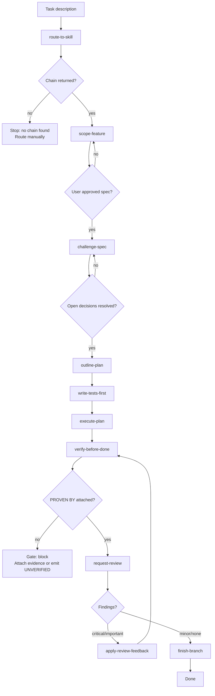

## Not this skill if
- You need only one step (a plan, a review, a merge) — invoke that skill directly
- The task scope is unclear — use `scope-feature` standalone first
- Any prior layer is missing: Pinecone index, telemetry log, or `proof-gate` hook

# orchestrate-feature — autonomous full-cycle development

## Purpose

Run the complete development loop for a task without manual skill-hopping. The chain runs autonomously; it pauses only when a gate fires or when a decision requires human input. Every step is logged to telemetry. Every completion claim carries `PROVEN BY:`.

This skill is the capstone: `route-to-skill` feeds the chain, `proof-gate` enforces it, and every prior skill executes inside it.

## Core rule

> **Rule:** A gate firing is not a failure — it is the skill working correctly. Stop, surface the finding, and wait for direction. Never override a gate silently.

## Chain



## Steps

### 1. Route

Invoke `route-to-skill` with the task description. If no chain is returned above the threshold, stop and ask the user to route manually or add a skill for the task type.

### 2. Scope

Invoke `scope-feature`. Run until the user approves the spec. Do not proceed to planning without explicit approval.

> **Checkpoint:** "Spec approved — proceeding to challenge-spec."

### 3. Challenge

Invoke `challenge-spec`. Run until no open decision branches remain (the skill's own stopping condition).

### 4. Plan

Invoke `outline-plan`. Save plan to `docs/plans/YYYY-MM-DD-<feature>.md`. Confirm the plan is free of placeholders before continuing.

### 5. Implement

Invoke `write-tests-first` for each task that touches logic. Then invoke `execute-plan`. Work task by task; checkpoint after every 5 tasks:

> "Status after Task N: completed X/Y tasks. [One sentence on current state.] Continuing unless you want to redirect."

### 6. Verify

Invoke `verify-before-done`. Attach `PROVEN BY:` to every completion claim. If a claim cannot be proven, emit `UNVERIFIED: <reason>` — never imply success.

`proof-gate` enforces the tag. If the gate fires, stop and surface the finding. Do not continue until the gate clears.

### 7. Review

Invoke `request-review`. Prepare the diff, verification steps, and `PROVEN BY:` evidence package. Wait for findings.

- **Critical or important findings:** invoke `apply-review-feedback`, then loop back to verify-before-done.
- **Minor or no findings:** proceed to finish.

### 8. Finish

Invoke `finish-branch`. Re-emit `PROVEN BY:` post-merge. Log the completed chain to `.forge/telemetry.jsonl`.

## Gate behaviour

| Gate | Trigger | Action |
|---|---|---|
| Spec not approved | User declines scope-feature output | Loop scope-feature |
| Open decisions remain | challenge-spec reports unresolved branch | Loop challenge-spec |
| PROVEN BY missing | proof-gate fires | Stop; attach evidence or emit UNVERIFIED |
| Critical review finding | request-review returns severity: critical | Loop verify → review |
| Repair loop budget exhausted | `apply-review-feedback` ran `escalation_budget` times without clearing review | STOP. Surface every failed attempt + the latest findings. Hand to user; do not loop further. |
| No skill chain found | route-to-skill returns empty | Stop; ask user to route manually |

## Telemetry

After each skill in the chain completes, append to `.forge/telemetry.jsonl`:

```json
{"skill": "scope-feature", "chain": "orchestrate-feature", "task_hash": "<hash>", "gate_blocked": false, "ts": "<iso>"}
```

`gate_blocked: true` if the skill's gate fired. This feeds `route-to-skill` and `analyse-routing`.

## Pitfalls

- Merging all skills into one mega-prompt — invoke each skill separately so its own gate logic fires.
- Continuing past a gate without logging `gate_blocked: true` — this corrupts telemetry and the adaptive router learns the wrong signal.
- Starting the chain without a Pinecone index — `route-to-skill` will fall back to keyword matching only; note this in the telemetry entry.
- Treating this skill as a replacement for the individual skills — it is an orchestrator, not a rewrite. Each skill's rules still apply in full inside the chain.

## Live progress

When `orchestrate-feature` fans out subagents — for example during `execute-plan` running parallel tasks, or when `wave-runner` is invoked inside the chain — invoke `parallel-run-dashboard` so progress is visible in real time.

Start the dashboard **after the first wave of agents launches**, before any results come back:

```bash
node server.mjs --port 7878 --state ./state.json
```

The dashboard shows:

- **Which agents are running, blocked, or complete** — any agent stuck in `running` longer than its peers is a signal to investigate before it blocks the merge step.
- **Per-agent token spend** — agents spending disproportionately many tokens may be looping or off-track.
- **The merge tree** — confirms which agents feed which consolidation step before the merge runs.

Before invoking the consolidation or `finish-branch` step, confirm in the dashboard that every required agent shows `done` and no agent feeding the merge tree shows `failed`. Attach a `PROVEN BY:` block from `GET /api/state` output as evidence.

See [`parallel-run-dashboard`](../parallel-run-dashboard/SKILL.md) for full setup and API reference.

## Pairs with

- [`route-to-skill`](../route-to-skill/SKILL.md): first step in the chain; provides the skill sequence
- [`scope-feature`](../scope-feature/SKILL.md): spec + approval gate
- [`challenge-spec`](../challenge-spec/SKILL.md): closes open decision branches
- [`outline-plan`](../outline-plan/SKILL.md): implementation plan
- [`write-tests-first`](../write-tests-first/SKILL.md): TDD step inside execute-plan
- [`execute-plan`](../execute-plan/SKILL.md): works through the plan task by task
- [`verify-before-done`](../verify-before-done/SKILL.md): evidence collection
- [`proof-gate`](../proof-gate/SKILL.md): gate enforcement
- [`request-review`](../request-review/SKILL.md): diff + evidence package
- [`apply-review-feedback`](../apply-review-feedback/SKILL.md): triage and apply findings
- [`finish-branch`](../finish-branch/SKILL.md): merge and post-merge proof
