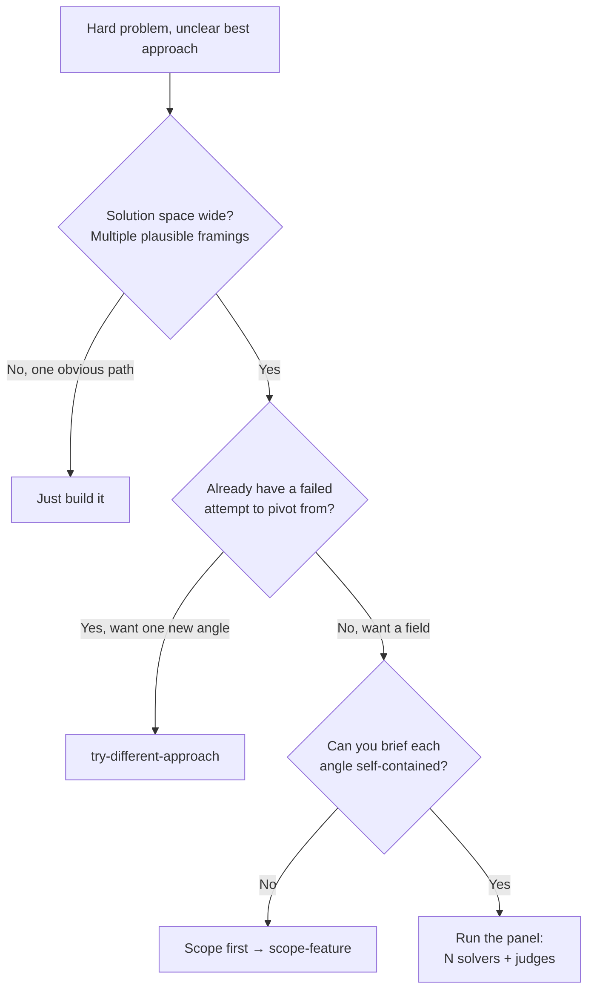

## Not this skill if

- **The approach is already obvious** → just build it; don't manufacture alternatives.
- **You have N independent *tasks*, not N competing *solutions* to one problem** → use `run-agents-in-parallel`.
- **One attempt failed and you want a different angle, not a tournament** → use `try-different-approach`.
- **You want to fuse two existing ideas, not run a field of fresh ones** → use `mash-ideas`.

# Parallel Judge Panel

## Purpose

When the solution space is wide, iterating on a single first attempt anchors you to that attempt's framing. Instead, generate several solutions from deliberately *different* angles in parallel, score them against the same rubric with independent judges, then build from the winner while grafting the best ideas from the runners-up. Diversity of starting angle beats depth of iteration when you don't yet know which framing is right.

**Core principle:** Explore the space in parallel before committing to a path; let independent judges, not the author, pick the winner.

## Triggers



**Use when:**
- The best approach is genuinely unclear and several framings are plausible.
- One-attempt-iterated keeps circling the first idea you had.
- The angles (MVP-first, risk-first, user-first, …) would produce materially different solutions.

**Don't use when:**
- The path is obvious — the panel is pure overhead.
- Each angle can't be briefed without the others' output (that's sequential, not a panel).

## The pattern

### 1. Fix the rubric first

Write the scoring rubric *before* generating any solution, so judges grade against an external standard, not against whichever solution they read first. Keep it to 3-5 weighted criteria, e.g.:

```
correctness   (0-10, weight 3)  — does it actually solve the stated problem?
simplicity    (0-10, weight 2)  — fewest moving parts to maintain
risk          (0-10, weight 2)  — blast radius if wrong; reversibility
fit           (0-10, weight 2)  — matches existing patterns / constraints
time-to-ship  (0-10, weight 1)
```

If you can't state the rubric, you can't run the panel — go back to `scope-feature` or `challenge-spec`.

### 2. Pick distinct angles

Assign each solver a different *framing*, not just "try again." Distinct angles force exploration of separate regions of the space:

- **MVP-first** — smallest thing that ships and proves value.
- **Risk-first** — minimize blast radius and irreversibility above all.
- **User-first** — optimize the end-user experience, cost later.
- (Add **performance-first**, **maintainability-first**, etc. as the problem warrants.)

Choose 3-4 angles. Two is too few to call it a panel; more than ~5-6 hits the concurrency ceiling (see step 3).

### 3. Prove independence, then dispatch the solvers

This is `run-agents-in-parallel` applied to *solutions*. The same hard constraints hold:

- **File test:** each solver works in isolation — separate scratch space / branch / worktree (`using-git-worktrees`). No two solvers write the same file.
- **Context test:** each solver gets the same problem statement and rubric, and starts cold. A solver must not need another solver's output to begin.
- **Width cap:** at most ~5-6 concurrent solvers. Beyond that, run in waves or cut angles — scale *rounds*, not width.

Give each solver a self-contained brief: the problem, its assigned angle, the rubric (so it self-optimizes), the files it owns, and the exact result shape (proposed solution + a one-paragraph rationale).

```
solver[MVP-first]   → solution A + rationale
solver[risk-first]  → solution B + rationale
solver[user-first]  → solution C + rationale
```

### 4. Judge in parallel, blind to authorship

Dispatch a separate batch of judge agents. Each judge scores **all** solutions against the rubric independently. Strip the angle labels so judges grade the solution, not the strategy name.

- Use 2-3 judges, not one — a single judge is a single point of bias.
- Each judge returns a score per criterion per solution, plus a one-line justification.
- Average the judges' scores. Flag any solution where judges disagree sharply (>3 points spread) — that's a signal the rubric is ambiguous or the solution is polarizing, not a clean winner.

```
        correctness simplicity risk fit time  weighted
sol A       8           9        6    7    9     ...
sol B       9           6        9    8    5     ...   ← winner
sol C       7           7        7    9    6     ...
```

### 4b. Harden the verdict (high-stakes panels only)

When the decision is expensive to get wrong, add three guards adapted from adversarial review panels — skip them for routine panels where they are pure overhead:

- **Blind commit, then debate.** Judges score independently and commit verdicts *before* seeing each other (step 4 already does this). Only then run 1–3 debate rounds where they see peers' scores and may revise. A judge that *changes position without citing new evidence* is flagged for sycophancy — discount the shift.
- **Correlated-bias warning.** If all judges agree unanimously on every criterion, treat it as a smell, not a triumph: identical scores across independent judges usually means the rubric is leading or the judges anchored on the same surface cue. Spot-check the unanimous winner against the rubric by hand.
- **Post-judge verification gate.** Any *new* deciding factor a judge introduces that no solver actually raised (a claimed flaw, a claimed advantage) must be re-verified against the artifact before it moves the ranking. Demote hallucinated factors and re-tally. This stops a confident-but-confabulated judge remark from picking the winner.

### 5. Synthesize from the winner, graft the rest

Do **not** just ship the top-scoring solution untouched. Build from the winner as the base, then graft the standout pieces from the runners-up — the risk-mitigation from B, the UX detail from C. This is where `mash-ideas` takes over: the panel surfaces the parts; mash-ideas fuses them into one coherent design.

Record *why* the winner won and which grafts you took, so the discarded angles aren't silently lost (pair with `decision-ledger`).

### 6. Verify the synthesized result

The merged design is a new artifact — no judge scored *it*. Verify it solves the original problem before claiming done. Pair with `verify-before-done`; gate any completion claim through `proof-gate`.

## Common mistakes

❌ Same angle three times ("try harder") → three flavors of the same first idea.
✅ Assign genuinely different framings so the solvers explore separate regions.

❌ Author picks the winner → confirmation bias toward your favorite framing.
✅ Independent judges score blind against a pre-written rubric.

❌ One judge → a single biased verdict.
✅ 2-3 judges, averaged, with sharp disagreement flagged.

❌ Shipping the top score verbatim → you discard the best ideas from the runners-up.
✅ Synthesize from the winner and graft standout pieces (hand off to `mash-ideas`).

❌ Eight solvers at once → context thrash and degraded output.
✅ Cap at ~5-6; cut angles or run in waves beyond that.

❌ Treating the synthesized design as already proven because its parts scored well → integration bugs slip through.
✅ Verify the merged artifact as a whole.

## Verification

The panel is not done when judges return scores — it is done when the *synthesized* design is verified against the original problem. End with `verify-before-done`, and gate any completion claim through `proof-gate`.

PROVEN BY: rubric written before solving, N distinct-angle solutions collected, scored by ≥2 independent blind judges, winner synthesized with grafts recorded, and the merged design verified green. For high-stakes panels, also: debate round run with sycophantic shifts discounted, unanimity spot-checked, and any judge-introduced deciding factor re-verified before it moved the ranking.

## Adapt from
- **`wan-huiyan/agent-review-panel`** (MIT) — adversarial review panel: blind final scoring, debate rounds with sycophancy detection, correlated-bias warning, and a post-judge severity-verification gate (steps 4b). <https://github.com/wan-huiyan/agent-review-panel>
