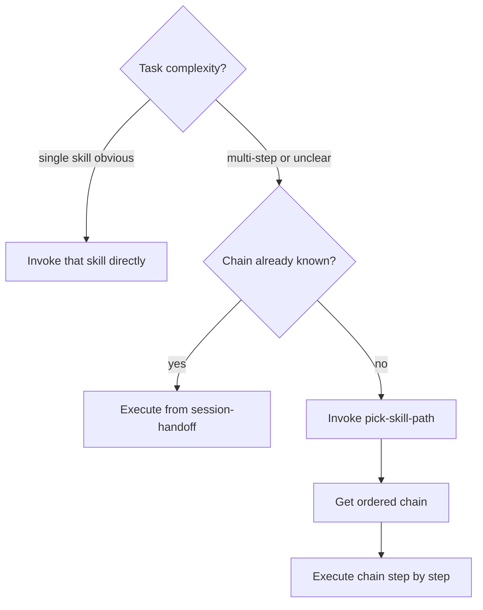

## Not this skill if
- The task is trivial and a single skill obviously applies — invoke that skill directly
- You want a single best-match skill for a keyword — use `skill-router` or `semantic-router`
- The chain is already known from a prior session — resume from the `session-handoff` block

# pick-skill-path — ordered skill chains for non-trivial tasks

## Purpose

`skill-router` picks skills. `semantic-router` matches keywords. Neither answers: *in what order*, and *why does each step hand off to the next?* This skill does.

Given a task description, it returns the ordered chain of skills to invoke — each with what it produces and what the next skill expects from it. The chain is a concrete execution plan, not a prose recommendation.

**Different from skill-router:** `skill-router` fires on every turn to pick one applicable skill. This skill is invoked once, deliberately, to plan a multi-skill sequence before execution begins.

## When to use



## Process

0. **Check the registry first.** Read `skills/v1/chains/INDEX.md`. If an existing named
   chain matches the task shape, use it (run `chain-run.sh start <name>`) instead of
   deriving a fresh chain. Only derive when no chain matches.
1. Read the task description
2. Identify the task shape (see shape table below)
3. Select the canonical chain for that shape, or compose from primitives if novel
4. For each link, state: what the skill produces and what the next skill consumes
5. Emit the chain as a numbered list with handoff notes
6. Do not begin execution — return the chain to the user for review

## Task shape table

| Task shape | Canonical chain |
|------------|----------------|
| New feature | `scope-feature` → `outline-plan` → `execute-plan` or `spawn-subagent` → `verify-before-done` → `finish-branch` |
| New feature (complex / parallel) | `scope-feature` → `outline-plan` → `conflict-graph-scheduler` → `wave-runner` → `verify-before-done` → `finish-branch` |
| Bug fix | `find-root-cause` → `write-tests-first` → `execute-plan` → `verify-before-done` → `finish-branch` |
| Hard bug (survived first pass) | `diagnose-bug` → `delta-debugger` → `write-tests-first` → `verify-before-done` → `finish-branch` |
| Stuck / not making progress | `try-different-approach` → [routed skill] → `verify-before-done` |
| Unknown codebase | `see-big-picture` → `scope-feature` → canonical feature chain |
| Context exhausted | `check-remaining-context` → `shrink-context` or `session-handoff` |
| Skill authoring | `writing-skills` → `verify-before-done` |
| Code review response | `apply-review-feedback` → `write-tests-first` → `verify-before-done` → `finish-branch` |

## Output format

Emit the chain as a numbered list. Each step includes:
- Skill name
- What it produces (one line)
- What the next step consumes from it (one line)

**Example — "build a new feature":**

```
1. scope-feature
   Produces: approved spec with constraints, success criteria, non-goals
   → outline-plan consumes: the spec (used to write file-level tasks)

2. outline-plan
   Produces: plan file at docs/plans/YYYY-MM-DD-<feature>.md (5–15 tasks, each with DONE WHEN clause)
   → execute-plan consumes: the plan file (works through it task by task)

3. execute-plan
   Produces: committed implementation + RUN.md state file
   → verify-before-done consumes: the implementation (runs verification command now)

4. verify-before-done
   Produces: PROVEN BY: block (command run → output seen → conclusion)
   → finish-branch consumes: the proof block (required before merge decision)

5. finish-branch
   Produces: merged or pushed branch + post-merge proof
```

**Example — "fix a bug":**

```
1. find-root-cause
   Produces: written hypothesis + PROVEN BY: repro (must match actual observed failure)
   → write-tests-first consumes: the hypothesis (writes a failing test that pins the bug)

2. write-tests-first
   Produces: failing test that proves the bug exists
   → execute-plan or direct implementation consumes: the failing test (writes minimal fix)

3. [implementation]
   Produces: passing test + fix committed
   → verify-before-done consumes: the passing test suite

4. verify-before-done
   Produces: PROVEN BY: block
   → finish-branch consumes: proof block

5. finish-branch
   Produces: merged branch + post-merge proof
```

## Adapting canonical chains

Drop a step when it genuinely does not fit. Add a step when the canonical chain has a gap. Rules:

- Do not drop `verify-before-done` — the proof chain is mandatory
- Do not drop `finish-branch` if the work will be shipped
- Add `challenge-spec` after `scope-feature` when requirements are ambiguous
- Add `conflict-graph-scheduler` before `wave-runner` when parallel tasks share files
- Add `check-token-usage` at any point when context feels tight

## Pitfalls

| Pitfall | Fix |
|---------|-----|
| Returning a list of skills without ordering | Always number the chain and state the handoff direction |
| Merging skills that must run sequentially | Keep them as separate steps — the handoff note explains why |
| Picking a chain then executing immediately | Return the chain first; the user reviews before execution begins |
| Using this skill for single-skill tasks | Invoke the skill directly — pick-skill-path adds friction without value |

## Integration

- `skill-router` — the entry gate that fires on every turn; this skill plans a multi-step chain deliberately
- `semantic-router` — keyword-based single-skill matching; use when a single skill is the answer
- `orchestrate-feature` — full autonomous execution of a feature chain; this skill produces the chain that orchestrate-feature would run
- `wave-runner` — when the chain includes parallel execution, wave-runner runs the parallel steps
