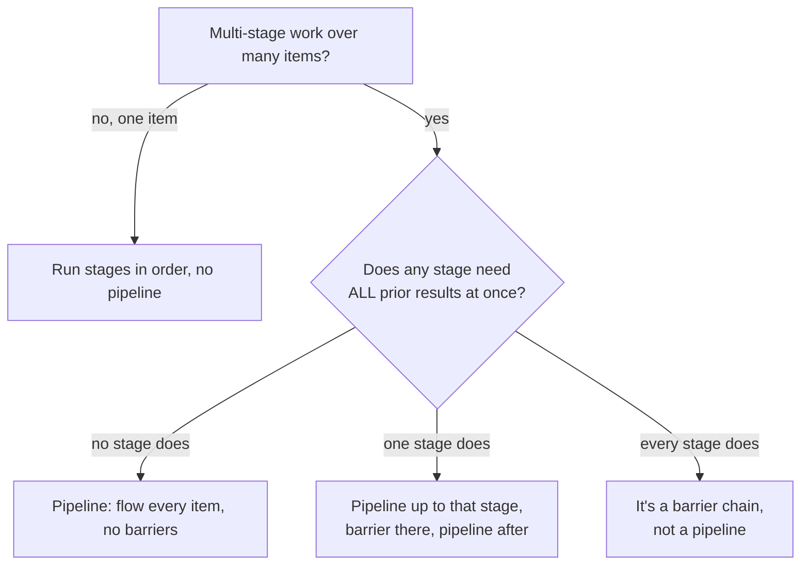

## Not this skill if

- You want a **barrier between every wave** — fan out a layer, join, verify, then advance (the dev-loop / `orchestrate-feature` build engine) → use `wave-runner`. Deciding factor: `wave-runner` holds a **per-wave barrier** (nothing in the next wave starts until the current wave is joined and verified); `pipeline-parallel` has **no barrier** (each item flows to the next stage the instant it clears, overlapping with siblings still upstream). Choose by whether you need verify-between-waves (wave-runner) or maximum throughput with no join (pipeline-parallel).
- Tasks are independent and each is a single step, not a multi-stage flow → use `run-agents-in-parallel`.
- You have ONE item moving through stages — there is no throughput to gain from a pipeline. Just run the stages in order.
- A downstream stage genuinely needs *every* upstream result at once (global sort, aggregate, dedupe across all items) → that stage is a real barrier; keep it.

# Pipeline Parallel

## Purpose

Many items, each passing through the same ordered stages (parse → transform → validate → write). The naive shape puts a barrier between every stage: finish ALL parses, then ALL transforms, then ALL validates. That barrier is dead time — the slowest item in each stage stalls every other item. A pipeline removes the barriers: as soon as one item clears a stage, it flows to the next while later items are still upstream.

**Core principle:** No barrier between stages unless a stage provably needs every prior result at once. Default to flow; justify each barrier.

## Triggers



**Use when:** the same ordered stages run over many items, stages have uneven duration, and most stages act on one item at a time.

**Don't use when:** a single item, truly independent one-shot tasks (`run-agents-in-parallel`), or every stage is a genuine aggregate.

## The pattern

### 1. List the stages and the items

Write the stages in order and the item set. State which stage, if any, needs all prior items at once. If none does, the whole flow pipelines.

```
items:  [doc1 .. docN]
stages: parse -> transform -> validate -> write
barrier: none   # no stage needs all docs at once
```

### 2. Prove each stage is per-item

A stage belongs in the flowing part of the pipeline only if it operates on **one item** using **only that item's upstream output**. Test each stage:

- Does it read another item's result? If yes, it is a barrier candidate — stop the flow there.
- Does it write shared state that a sibling item also writes? If yes, same file/same resource → not safe to overlap (the file+context independence test from `run-agents-in-parallel` applies per stage, not per item).

Per-item stages flow. Anything failing the test becomes an explicit barrier.

### 3. Hand each item to the next stage the moment it clears

Do not wait for the cohort. As an item finishes a stage, push it downstream immediately.

```python
# barrier shape (avoid): every item waits for the slowest at each step
parsed    = [parse(d) for d in docs]        # all parses finish first
xformed   = [transform(p) for p in parsed]  # then all transforms
written   = [write(validate(x)) for x in xformed]

# pipeline shape: one item flows end-to-end, overlapping with the rest
def flow(d):
    return write(validate(transform(parse(d))))
results = run_in_parallel(flow, docs)   # items overlap across stages
```

In a queue/worker form, give each stage its own worker pool and connect them with bounded queues so a fast stage can run ahead while a slow stage drains.

### 4. Cap concurrency, not stages

Width is bounded the same way as `run-agents-in-parallel`: at most ~5-6 items in flight concurrently. More items than that → deepen the pipeline (more rounds through the worker pool), do not widen it. Stage *count* is free; in-flight *item count* is the limit.

### 5. Isolate per-item work that touches the filesystem

If a stage writes files, give each item its own path or workspace so overlapping items never collide. For code-producing stages, pair with `using-git-worktrees` so each item's branch is independent.

### 6. Place each real barrier explicitly

When one stage truly needs all upstream results (e.g. global dedupe before write), make the barrier visible: pipeline up to it, collect, run the aggregate once, then resume the pipeline. One justified barrier, not one per stage.

```
parse -> transform  ──┐
                      ▼ (barrier: dedupe across all items, runs once)
                   dedupe
                      │
                      ▼
            validate -> write   (pipeline resumes)
```

## Coordinating across stages

This pipeline is barrier-free **by design** — it carries no shared-state coordination layer, and it should not grow one. The whole value is that an item flows the instant it clears a stage, never registering with or waiting on its siblings. A `.claude/team/EPIC.md`-style shared-state file plus an agent handshake is the opposite shape: coordinated waves around shared state. That belongs to `wave-runner` / `orchestrate-feature`, not here. Adding it would contradict the core principle above.

There is still one legitimate cross-stage need — passing an item's state across a stage boundary — and existing skills already own it:

- **A stage is run by a separate agent that needs upstream state** → hand off with `agent-handoff`. Its bundle is built for exactly this ("between pipeline stages"): the upstream agent packages what the next stage needs, the downstream agent starts cold from the bundle alone.
- **Stages must share a named value within the session without round-tripping through prose** → use `context-variable-relay`. Write the value once under a key; the next stage reads it directly instead of parsing it back out of conversation text.

Both keep the flow intact: per-item handoffs and a write-once key/value side channel, never a barrier or a join.

## Common mistakes

❌ Barrier between every stage "to keep it simple" — that serializes the whole job to the slowest item per step.
✅ Flow each item through all stages; add a barrier only where a stage reads every prior result.

❌ Widening to one worker per item (20+ in flight) — same blast radius and contention `run-agents-in-parallel` warns against.
✅ Cap in-flight items at ~5-6; deepen with more rounds when there are more items.

❌ Overlapping stages that write the same file or shared resource.
✅ Apply the file+context independence test per stage; isolate per-item paths or use `using-git-worktrees`.

❌ Calling a true aggregate (global sort, cross-item dedupe) a "stage" and trying to flow it.
✅ Mark it a barrier, run it once on the collected set, then resume flowing.

❌ Claiming the pipeline is correct because it ran without crashing.
✅ Prove order and completeness: every item passed every stage in order, and barrier stages saw the full set.

---

**PROVEN BY:** run the pipeline and show, per item, that it cleared every stage in order and the output count equals the input count; for any barrier stage, show it received all upstream items. Pair with `verify-before-done` + `proof-gate` before claiming the pipeline is complete.
