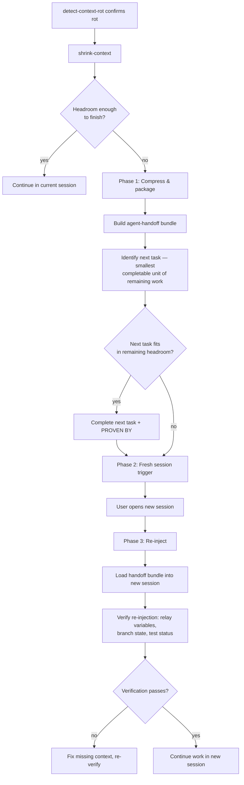

## Not this skill if
- Context usage is below 70% — use `shrink-context` first, only escalate here if still stuck
- You are not yet sure context rot is the problem — use `detect-context-rot` to confirm
- The session is fresh and you just want to start clean — no recovery needed

# progressive-context-recovery — orchestrated session handoff on context exhaustion

## Purpose

`shrink-context` buys headroom by compressing the conversation. But when context is past 85% and the task is not done, compression is not enough — the session cannot complete the work. You need a new session.

The risk: everything in the current session that is not in the codebase or git history is about to be lost. Decisions made, hypotheses ruled out, constraints discovered, partial state.

This skill packages that knowledge into a structured handoff bundle using `agent-handoff`, then re-injects only the subset the next task needs into a fresh session. The new session starts informed, not blank.

## Core rule

> **Rule:** Compress first. Only open a new session if the task cannot complete in the remaining headroom after compression. Each phase is a gate — do not proceed to the next until the current phase passes.

## Flow



## Phase 1 — Compress and package

### 1a. Shrink what you can

Run `shrink-context`. If remaining headroom drops below 15% after compression, do not attempt to continue — move directly to packaging.

### 1b. Complete the smallest safe unit

If headroom allows, complete the next atomic task before handoff. Partial work is harder to hand off than completed work. But do not start a task you cannot finish — partial states are worse than clean cut points.

### 1c. Capture current state

Collect:
- **Branch and last commit:** `git branch --show-current` + `git rev-parse HEAD`
- **Unstaged changes:** `git stash` if the session ends before they commit
- **Test status:** run the test suite; record passing / failing counts
- **Open decisions:** every decision made this session not visible in code or commits
- **Ruled-out approaches:** hypotheses tested and rejected — critical to prevent new session repeating them
- **Relay variables:** dump all keys from `context-variable-relay` session store

### 1d. Build the handoff bundle

Use `agent-handoff` to build the bundle. The bundle is the artefact that survives session death.

Key fields to populate carefully:
- `decisions` — ruled-out approaches go here, not just chosen ones
- `open-questions` — must be real questions; do not list rhetorical hedges
- `evidence` — include `PROVEN BY` for every completed subtask, even if partial

Write the bundle to `docs/plans/session-handoff-<date>.md` and commit it. The commit ensures it survives even if the session file is lost.

## Phase 2 — Fresh session trigger

Tell the user:
```
Context recovery required. Handoff bundle committed to:
  docs/plans/session-handoff-<date>.md

Open a new Claude Code session and run:
  /skill progressive-context-recovery --resume <bundle-path>

The new session will re-inject the handoff and continue from:
  Branch: <branch> | Commit: <sha> | Next task: <task>
```

Do not attempt to open the new session autonomously — this requires the user to start it.

## Phase 3 — Re-injection (new session)

When the new session starts with `--resume <bundle-path>`:

### 3a. Load the bundle

Read `docs/plans/session-handoff-<bundle-date>.md`. Parse all sections. Do not load the full previous conversation — the bundle is the complete context.

### 3b. Restore relay variables

Re-write all relay variables from the bundle's state section into the new session's relay store using `context-variable-relay` SET operations.

### 3c. Verify branch state

```bash
git branch --show-current        # confirm branch matches bundle
git rev-parse HEAD               # confirm commit SHA matches
git stash list                   # check for any stashed uncommitted work
```

If the stash contains work from the previous session, pop it before continuing.

### 3d. Verify test status

Run the test suite. Confirm test status matches what the bundle recorded. If it does not match (e.g. tests now failing that were passing), treat it as a new bug — do not proceed until the discrepancy is understood.

### 3e. Acknowledge and continue

Once verification passes:
```
Session recovered from handoff: docs/plans/session-handoff-<date>.md
Branch: <branch> | Commit: <sha> | Tests: <status>
Ruled out (do not retry): <ruled-out approaches from bundle>
Resuming: <next task from bundle>
```

Then continue with the next task as if the session never ended.

## Related skills

- `detect-context-rot` — confirms rot; invoke before this skill
- `shrink-context` — attempt compression first; this skill escalates when shrink is insufficient
- `agent-handoff` — the bundling mechanism; phase 1 uses it directly
- `context-variable-relay` — relay variables are captured and restored across sessions
- `outline-plan` — the plan file tells the new session what work remains
- `check-remaining-context` — used in the gate between phase 1 compression and phase 2
