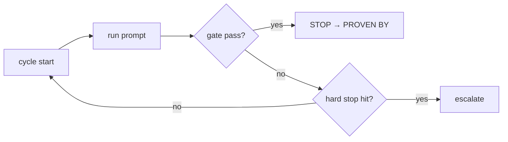

## Not this skill if
- A bounded single pass — use execute-plan
- No objective completion gate exists — define one first; a loop without a gate never terminates

# Ralph Loop (Adapted)

## Purpose

Run the same prompt on repeat until an objective gate passes, then stop. The gate — not the model's opinion — is what makes the loop safe to exit.

## Triggers

**Use when**
- Instruction is "keep going until it's done" or equivalent.
- Task requires grinding down a flaky test suite across multiple cycles.
- Long autonomous build or refactor where convergence is unpredictable.

**Don't use when**
- Scope is fully bounded and a single `execute-plan` pass is sufficient.
- No objective gate exists (tests, lint, proof check) — define one first.



## The pattern

### Native options

| Mode | Primitive | When to prefer |
|---|---|---|
| **ralph-loop plugin** | `ralph-loop` start/cancel | Installed; simplest invocation |
| **Dynamic `/loop`** | `/loop` (DYNAMIC) + `ScheduleWakeup` | Plugin absent; need model-self-paced cadence |

### Cycle steps

1. **Define gate** — identify the objective stop condition before starting (e.g. `npm test` green, lint clean, `proof-gate` pass). **REQUIRED.**
2. **Set hard cap** — maximum cycle count or wall-clock budget. Never open-ended.
3. **Start loop** — invoke `ralph-loop start <prompt>` or `/loop` in DYNAMIC mode.
4. **Per-cycle check** — run the gate command at cycle end. Do not self-assess.
5. **Gate pass** → exit, emit `PROVEN BY:`. Gate fail + cap not hit → next cycle. Cap hit without gate pass → escalate.

## Cheat sheet

```
# ralph-loop plugin
ralph-loop start "fix all failing tests" --gate "npm test" --max-cycles 10

# /loop dynamic fallback
/loop  # model self-paces; call ScheduleWakeup between cycles
```

Per-cycle log entry: cycle number, gate result, change summary, next action or stop reason.

## Pitfalls

| ❌ Failure mode | ✅ Correct approach |
|---|---|
| Accepting model's self-declared "done" as exit signal | Gate command must pass objectively; model opinion does not count |
| No hard stop — loop burns budget indefinitely | Set `--max-cycles` or a time cap before starting |
| Re-using a stale gate from the previous cycle | Re-run the gate fresh every cycle against current state |
| Looping on a task that cannot converge | Define convergence criteria first; escalate if none exist |

## After

Exit only when the gate passes. Run `verify-before-done`, then `proof-gate` to seal the claim.

```
PROVEN BY: npm test — 147 passed, 0 failed (cycle 4 of 10)
```
