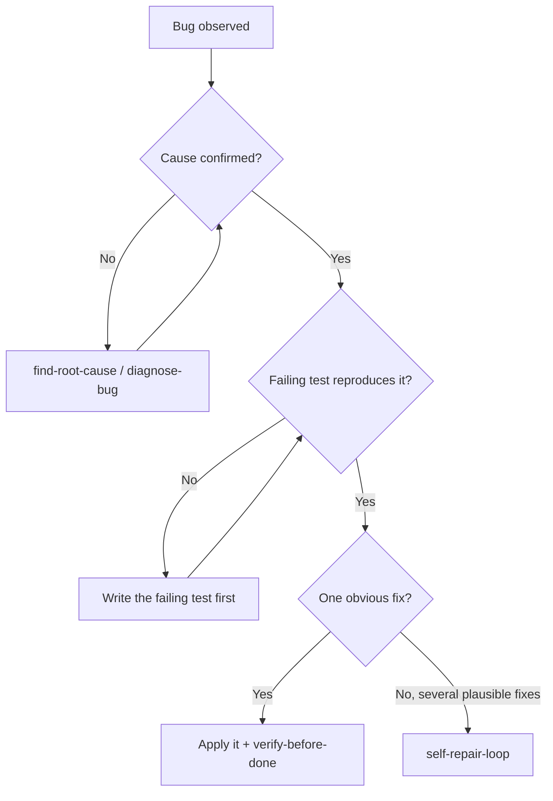

## Not this skill if

- **You want one fix loop, not a race.** If a single fix→verify cycle, repeated until the suite is green, is all you need, use the canonical/promoted `loop-until-green`. Deciding factor: `loop-until-green` runs **one** candidate through repeated cycles; *this* skill runs **multiple competing candidates in parallel** and lets the test pick a winner. Reach here only when you cannot cheaply tell which of several fixes is right.
- **The repro isn't minimal / you don't know which commit broke it.** Run `delta-debugger` first to shrink the failing input (ddmin) and localize the introducing commit (`git bisect`); a tight, minimal referee test makes every candidate in this loop faster and the verdict sharper.
- **The cause is unknown.** First run `find-root-cause` or `diagnose-bug`. This skill repairs a *confirmed* cause; it does not investigate.
- **You have no failing test that captures the bug.** Write one first (the loop's pass/fail signal *is* that test). Without it there is nothing to verify against.
- **The fix is obvious and single-path.** One clear change does not need a competing pool — just apply it and call `verify-before-done`. Use this only when the fix is genuinely uncertain and multiple plausible approaches exist.

# Self-Repair Loop

## Purpose

An autonomous bug-fixing harness. Once a bug is reduced to a reproducible failing test, spawn several agents that each propose a *different* fix, verify every candidate in its own isolated worktree, and merge the first one whose change makes the failing test pass without breaking the rest of the suite. This converts "I don't know which fix is right" into a race with a mechanical winner.

**Core principle:** The failing test is the referee. Generate competing fixes in parallel, let isolation prevent cross-contamination, and let the test — not opinion — pick the winner.

## Triggers



**Use when:**
- The root cause is established and there is a reproducible **failing test**.
- Two or more *independent* fix strategies are plausible and you cannot cheaply tell which is correct.
- You want the fix decided by evidence, not by guessing.

**Don't use when:**
- The cause is still a hypothesis (go back to `find-root-cause` / `diagnose-bug`).
- Candidate fixes touch the same files and cannot be isolated — see the independence test below.

## The pattern

### 1. Lock the referee

Confirm the failing test before spawning anything. It must fail *for the right reason* (the bug), and pass only when the bug is gone.

```bash
# Baseline: this MUST fail now, naming the real defect.
pytest tests/test_payment.py::test_refund_rounding -x
# expected: 1 failed
```

If you cannot produce this, stop. There is no referee and the loop is meaningless.

### 2. Generate competing fixes (fan out)

Spawn one agent per candidate strategy via `run-agents-in-parallel`. Each agent gets: the failing test, the confirmed root cause, and the *one* approach it must pursue. Do not let agents free-style — assign distinct strategies so candidates differ.

Respect the hard limits from `run-agents-in-parallel`:
- **Independence test** — every candidate must be modifiable without reading or waiting on another candidate's files or context. If two strategies must edit the same code path, they are not independent; collapse them into one agent or sequence them as rounds.
- **Width cap ~5–6** — never exceed roughly five to six concurrent agents. If you have more strategies than that, run them in rounds (depth), not wider fan-out.

```
candidates:
  - A: guard rounding at the boundary before persistence
  - B: change the stored type to integer minor-units
  - C: apply banker's rounding in the calc layer
```

### 3. Isolate every candidate

Give each candidate its own workspace via `isolate-parallel-writes` (one worktree per candidate, per `using-git-worktrees`). No two agents may share a working tree — a shared tree lets one fix mask or clobber another and corrupts the verdict.

```bash
# one worktree per candidate; agents never see each other's edits
git worktree add ../repair-A repair/A
git worktree add ../repair-B repair/B
git worktree add ../repair-C repair/C
```

### 4. Verify each in isolation (verifier pool)

For every candidate, run the referee test **plus** the surrounding suite inside that candidate's worktree only. A candidate "passes" only when the failing test goes green *and* nothing else regresses.

```bash
# inside ../repair-A
pytest tests/test_payment.py::test_refund_rounding && pytest -q
# pass = referee green AND full suite green
```

A fix that flips the referee but breaks three other tests is a **failure**, not a win.

### 5. Merge the first clean winner

Take the earliest candidate that passes step 4 cleanly. Merge that worktree's branch. Stop the remaining agents — the race is decided.

```bash
git merge --no-ff repair/A
```

If a winner emerges, record the losers briefly (why each failed) — that note often reveals adjacent latent bugs worth a follow-up.

### 6. Handle no-winner

If *no* candidate passes cleanly: the root cause is wrong or incomplete. Do **not** loosen the test to force a pass. Return to `find-root-cause` / `diagnose-bug` with the failure modes from each candidate as new evidence, then re-enter the loop with a corrected cause.

Bound the re-entry. Track rounds: if `round_budget` (default 3) rounds of competing fixes produce no clean winner, stop the race and escalate to `find-root-cause` / `diagnose-bug` with the accumulated failure modes from *every* candidate across *all* rounds as new evidence. Do not keep spawning rounds — a persistent no-winner means the cause is wrong, not that more attempts are needed. The budget bounds the number of *rounds*; it is not a sequential per-fix retry counter, and it does not narrow the parallel race within a round.

## Common mistakes

- ❌ Running the loop on an unconfirmed cause — you race to "fix" the wrong thing.
  ✅ Establish cause with `find-root-cause` / `diagnose-bug` first; the loop only repairs.

- ❌ Letting candidates share one working tree to "save setup time."
  ✅ One worktree per candidate via `isolate-parallel-writes`; isolation is what makes the verdict trustworthy.

- ❌ Declaring a winner because the referee test passed, ignoring the rest of the suite.
  ✅ A win requires the referee green *and* zero regressions across the full suite.

- ❌ Spawning ten agents because there are ten ideas.
  ✅ Cap concurrency at ~5–6; run extra strategies as later rounds, not wider fan-out.

- ❌ Weakening or deleting the failing test when nothing passes.
  ✅ No-winner means the cause is wrong — go re-diagnose, never edit the referee to make red turn green.

## Verification

A merged fix from this loop is a completion claim and must be proven, not asserted. Hand off to `verify-before-done` and gate with `proof-gate` before declaring the bug fixed.

PROVEN BY: the referee test transitioning from `1 failed` to `passed` on the merged branch, with the full suite green — captured as command output in the `verify-before-done` evidence block.
