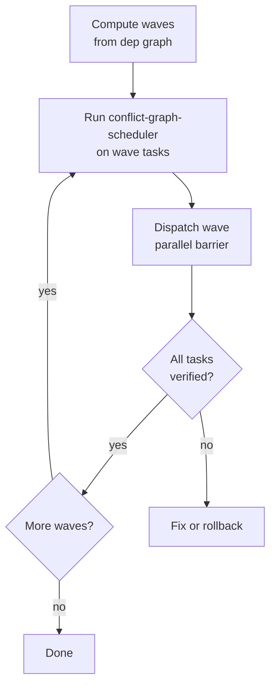

## Not this skill if
- Tasks are fully independent with no dependency ordering — use conflict-graph-scheduler + run-agents-in-parallel
- A single linear task — use execute-plan
- You need the full feature lifecycle (scope → plan → build → verify → ship), not just the parallel build engine — use `parallel-orchestrate-feature` (it delegates its build stage to this skill)
- You want items to flow through stages with no barrier between them (max throughput) rather than a per-wave verify barrier — use `pipeline-parallel`

# Wave Runner

## Purpose

Execute a dependency-ordered plan by computing topological waves, dispatching each wave in parallel, and blocking advancement until every task is verified. The wave gate — not the dispatch — is the core guarantee.

## Triggers

**Use when**
- A plan has tasks with `depends_on` declarations forming a DAG.
- You need autonomous parallel execution with per-wave proof.
- You are at orchestrate-feature step 5.

**Don't use when**
- No dependency structure — use **conflict-graph-scheduler** + **run-agents-in-parallel** directly.
- Single linear chain with no parallelism — use **execute-plan**.



## The pattern

1. **Parse.** Extract tasks and `depends_on` lists; build a DAG.
2. **Compute waves.** Wave 1 = tasks with no deps; Wave N = tasks whose deps are satisfied by prior waves.
3. **Split conflicts.** Run **conflict-graph-scheduler** (**REQUIRED**) on the wave's tasks. Tasks sharing a file scope go into sequential sub-batches.
4. **Dispatch the wave.** Use a `parallel()` barrier or parallel `Agent` calls. Apply `isolation: 'worktree'` (see **worktree-pool**) only when agents share a branch.
5. **Gate.** Run **verify-before-done** on every task. One failure blocks the next wave.
6. **Fix or rollback.** Fix in place. On a hard gate failure, saga-rollback the wave and re-plan.
7. **Advance.** Repeat steps 3–6 for each subsequent wave.

### Worked example

| Task | depends_on | File scope |
|------|-----------|------------|
| T1 | — | `auth/models.py` |
| T2 | — | `db/schema.sql` |
| T3 | T1 | `auth/login.py` |
| T4 | T1, T2 | `api/routes.py` |

- **Wave 1:** T1 + T2 — disjoint scopes → parallel → gate passes → advance.
- **Wave 2:** T3 + T4 — disjoint scopes → parallel → gate passes → done.

> **Shared-file split:** if Wave 2 = {T3, T4} but both declare `util.py`, conflict-graph-scheduler splits them — T3 runs in sub-batch 2a, T4 in 2b — so the wave never races on `util.py`.

## Saga-style rollback (compensation)

Register a **compensating action** (the inverse) for each task at dispatch time — revert the commit, drop the migration, delete the created resource. When a wave fails its barrier and can't be repaired in place, run the compensations **in reverse dispatch order** to restore the pre-wave state, then re-plan or stop. This prevents a half-applied wave from leaving the repo in a broken intermediate state. Pair it with a **circuit breaker**: after N verify↔review oscillations on the same wave, stop and escalate instead of looping the gate forever.

## Executable dispatch (hook-driven enforcement)

The pattern above is a discipline; hooks make it *mechanical* so a wave can't advance by accident. Wire the wave gate to Claude Code's hook lifecycle:

| Hook | Enforces |
|------|----------|
| **PreToolUse** | Block (or nudge) a dispatch that violates the task graph — e.g. spawning a wave-N task while a wave-(N−1) dep is still open. Escalate silent → warning → block across repeated violations in a turn. |
| **PostToolUse** | Run the per-task verifier (lint/type/test) and only then mark the task continuation-eligible. |
| **SubagentStop** | Require the returning worker to update its task status and emit its evidence token. |
| **Stop** | Check whether the current wave's barrier is actually cleared before ending the turn; if not, keep going. |

**Return contract.** Each dispatched worker must return a machine-checkable signal — `DONE|{absolute/path}` — not prose. The orchestrator consolidates these (absolute paths, no ambiguity) and only triggers the next wave once every worker in the current wave has returned its `DONE`. A missing or malformed signal blocks advancement exactly like a failed verify.

**Conservative default.** When dependency analysis is *uncertain* whether two tasks conflict, run them sequentially, not in parallel. A wrongly-parallel wave that races on shared state costs more than a needlessly-sequential one. Only widen to parallel when `conflict-graph-scheduler` proves the scopes disjoint.

## Pitfalls

| ❌ Mistake | ✅ Fix |
|-----------|--------|
| Advancing before all tasks are verified | Gate on every task; partial pass = full block |
| Same-wave tasks sharing a file scope dispatched together | Run **conflict-graph-scheduler** and split into sequential sub-batches |
| Cascading a wave failure to the next wave | Fix or rollback the current wave; never advance with a known failure |
| Skipping `isolation: 'worktree'` when agents share a branch | Use **worktree-pool** isolation for concurrent branch writers |

## After

Each wave must produce a `PROVEN BY:` block listing verification evidence (tests, checks, proofs) that cleared the barrier. No wave is complete without it.

```
PROVEN BY: wave N gate cleared — all N tasks passed verify-before-done; evidence: [test run / proof block per task].
```
